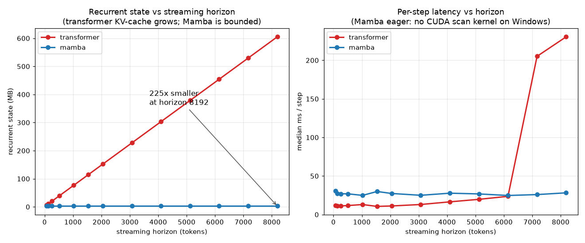

# Streaming Text-to-Motion with a Grouped-FSQ Tokenizer and a Token-Autoregressive State-Space Generator

**Master's dissertation -- draft v0.1**
Author: Catalin Butacu * *(advisor / institution placeholder)*

> Scope note (delete in final): contribution-only document, target **30-45 pages**. Each `sec. ` carries a
> page budget and a *Source* line pointing at the `paper/lessons/` file that holds the long-form
> derivation, so this draft expands to full length by absorbing that material. Numbers in **bold[*]**
> are final/measured; the controlled twin table (sec. 5.6) and the tokenizer matrix (sec. 4.4) are
> measured and complete at the 34M pilot scale, with only the 100M Mamba row still gated on cloud
> budget. Citations use `[Key]`; the bibliography (sec. References) gives the arXiv ids and is
> bibtex-ready for LaTeX/Overleaf.

---

## Abstract  *(1/2 p)*

Text-to-motion synthesis has reached high fidelity on HumanML3D, but the strongest systems are
**bidirectional and full-sequence** ([MoMask], FID 0.045), which precludes *real-time, incremental*
generation -- emitting motion as text arrives, with bounded compute per step. This thesis isolates the
mechanism needed for streaming and makes two contributions on the standard HumanML3D-263 benchmark
with the unmodified Guo evaluator [HumanML3D], so every number is field-comparable.
**(A) A Grouped-FSQ motion tokenizer.** We combine finite scalar quantization [FSQ], which is
codebook-free and collapse-free, with a grouped-residual structure, and show it **Pareto-dominates a
strong EMA+reset RVQ baseline** [MoMask][T2M-GPT] across six matched bit-rate cells, reaching
reconstruction FID **0.017[*]** (vs MoMask's RVQ 0.019).
**(B) The first token-autoregressive state-space (S6/Mamba) motion generator.** Against a
parameter-matched causal-transformer twin (the T2M-GPT mold [T2M-GPT]), trained on identical data,
seed and budget, we test whether a bounded-state recurrence matches a growing-KV-cache transformer at
equal quality while achieving **constant per-step memory** at long horizons. On the full test set
(20-rep protocol, 34M twins), the SSM **matches the transformer on text-motion matching** -- R@1
**0.255[*]** vs **0.246[*]**, R@3 **0.498[*]** vs **0.485[*]**, MM-Dist **5.00[*]** vs **5.26[*]** (the
SSM ahead on all three) -- while trailing modestly on distributional fidelity (FID **4.06[*]** vs
**3.30[*]**), and it does so with a recurrent state that is **constant at 2.68 MB** where the
transformer's KV-cache grows to **605 MB[*]** at 8192 tokens (a 225x gap). We further show that
unconditional **AMASS pretraining** of the generator -- learning the motion prior $p(z)$ on a large
unlabeled corpus before the captioned fine-tune -- cuts FID **6.58 -> 2.12[*]** at the pilot scale.
*(Twin comparison complete at the 34M pilot scale; the 100M Mamba row awaits cloud budget.)*

---

## 1. Introduction  *(~4 p)* -- *Source: lessons/00_roadmap.md, 16_related_work.md*

### 1.1 Motivation: the streaming gap
Generating 3D human motion from natural language enables animation, robotics and embodied agents.
The field's accuracy leaders -- [MoMask], [BAMM], masked-parallel residual transformers -- achieve
their FID by attending **bidirectionally over the whole sequence**, which is incompatible with the
*streaming* setting this thesis targets: producing whole-body motion **incrementally**, in bounded
memory per step, as the prompt is consumed. Causal autoregressive models ([T2M-GPT] 0.116, [Mogo]
0.079, [AttT2M] 0.112) *can* stream, but a transformer's KV-cache grows linearly with horizon, so
per-step cost is unbounded as motions lengthen.

### 1.2 Thesis statement
> A discrete, causal, token-autoregressive **state-space** generator can match a parameter-matched
> causal transformer in generation quality on HumanML3D-263 while generating in **bounded
> (constant) per-step memory**, on top of a quantizer that is itself stronger than the field-standard
> RVQ.

### 1.3 Contributions
1. **Grouped-FSQ tokenizer (Contribution A, sec. 4).** A finite-scalar-quantization tokenizer with a
   grouped-residual head; codebook-free (no EMA/commitment/dead-code machinery), ~100% code usage by
   construction [FSQ]. Benchmarked head-to-head against a strong RVQ [MoMask][T2M-GPT] at matched
   bit-rate; it Pareto-dominates (sec. 4.4).
2. **Token-AR S6/Mamba generator + the streaming result (Contribution B, sec. 5).** The first discrete
   next-token causal **Mamba/S6** [Mamba] text-to-motion generator, evaluated against a
   parameter-matched transformer twin under identical tokenizer/data/seed/budget -- a *controlled
   mechanism study*, not a scale race. The measured result (sec. 5.6): **parity at matched budget** --
   the SSM leads on R-precision and MM-Dist, trails modestly on FID -- delivered with a **bounded
   ($O(1)$) per-step state** where the transformer's KV-cache grows $O(L)$ (sec. 5.5).
3. **AMASS generator-pretraining (sec. 5.4).** Pretraining the motion prior on unlabeled AMASS tokens
   before the captioned fine-tune; an ablation showing a 3x FID reduction at pilot scale.

### 1.4 Scope and non-goals
We do **not** claim to beat [MoMask] in absolute FID, nor to compete on scale with million-clip
foundation models ([Being-M0], [LMM], [MotionMillion]). The contribution is the *mechanism*
(bounded-state sequence mixing for streaming) and the *tokenizer*, on a citable benchmark. Whole-body
SMPL-X (hands) and the live studio demo are presented qualitatively; face is deferred (ADR 0001).

### 1.5 Distinction from concurrent work
[AnyMo] (2026) uses a 4-stage residual-FSQ tokenizer but reports **no HumanML3D FID and releases no
code**; our head-to-head FSQ-vs-RVQ on standard 263 stands. [LLaMo]/[MotionStreamer] stream but with a
**continuous** autoregressive latent -- not a discrete next-token *SSM*. The discrete + causal + fixed-
state conjunction (sec. 5) is the unoccupied cell.

---

## 2. Background and Related Work  *(~6 p)* -- *Source: lessons/16_related_work.md, 04_data_landscape.md*

### 2.1 Motion representation
The HumanML3D-263 feature [HumanML3D] per frame: root angular velocity + linear velocity (4),
ric joint positions (63), 6D rotations (126), joint velocities (66), foot contacts (4); decoded to
22 joints by `recover_from_ric`. *(Detail sec. 3.1.)*

### 2.2 Discrete motion tokenization
VQ-VAE [VQVAE] underlies T2M-GPT, whose ablation shows naive VQ (FID 0.492) needs **EMA+code-reset**
to reach 0.070 [T2M-GPT]. Residual VQ [MoMask] stacks quantizers (RVQ 0.019, with quant-dropout).
**FSQ** [FSQ] replaces the learned codebook with a fixed scalar lattice -- no collapse, ~full usage;
shown to beat VQ on motion by [ScaMo] and, multi-scale, by [STMSQ] (recon 0.037 / gen 0.063). sec. 4
positions Grouped-FSQ against these.

### 2.3 Text-to-motion generators
Causal AR: [T2M-GPT], [Mogo] (streaming RVQ), [AttT2M]. Masked/bidirectional: [MoMask], [MMM],
[BAMM] (accurate, **non-streaming**). LLM-style: [MotionGPT]. sec. 2.5 explains why only causal-AR admits
the streaming runtime.

### 2.4 State-space models
S4 [S4] and the selective-scan **Mamba/S6** [Mamba]: sequence mixing in $O(L)$ training (parallel
scan) and $O(1)$ per-step state at inference. Prior motion-Mamba works ([Motion Mamba], [KMM]) embed
Mamba in **diffusion/masked** (bidirectional) pipelines -- none is token-AR. sec. 5 fills this gap.

### 2.5 The streaming requirement (why architecture is constrained)
A runtime generator must be **causal** (no future) and **bounded-state**. This disqualifies
full-sequence diffusion and bidirectional masking *as the runtime*, and motivates the
transformer-vs-SSM contrast: KV-cache $O(L)$ vs recurrent state $O(1)$ (sec. 5.5).

---

## 3. Motion Representation, Data, and Evaluation Protocol  *(~4 p)* -- *Source: lessons/01-04, 04a*

### 3.1 The 263 representation and round-trip
Channel layout, normalization with the official Mean/Std, `recover_from_ric` round-trip test
(asserted at module boundaries). *(Fill: shapes table from lessons/01-03.)*

### 3.2 Datasets
HumanML3D (~23k captioned clips, 263) [HumanML3D]; **AMASS** [AMASS] re-derived to 263 through the
SMPL-X body model (donor is the SMPL-X G release) -- **13,249[*]** sequences on disk, the unlabeled
pretraining corpus for sec. 5.4. Mirror augmentation; train/val/test from the canonical split.

### 3.3 Evaluation protocol (reused, unmodified -- comparability)
The **Guo evaluator** [HumanML3D] (`text_mot_match`, frozen) supplies the embedding space for
**FID**, **R-precision@1/2/3**, **Diversity**, **MultiModality**, **MM-Dist**, on the standard 263
input -- never retrained, keeping numbers field-comparable.
$$\mathrm{FID}=\lVert\mu_r-\mu_g\rVert^2+\operatorname{Tr}\!\big(\Sigma_r+\Sigma_g-2(\Sigma_r\Sigma_g)^{1/2}\big).$$
Protocol: 20-rep standard evaluation; **model selection on val, test touched once** (run manifests
record config + git + seed for every number). FID is sample-size biased -> fixed clip counts per
comparison (sec. 3.4).

### 3.4 Reproducibility
Seed 2026, strict determinism; `start_run` writes a config/commit/seed manifest and `log_metrics`
per epoch -- any quoted number traces to a run directory.

---

## 4. Contribution A -- The Grouped-FSQ Motion Tokenizer  *(~7 p)* -- *Source: lessons/05-07, 07.0a, 18*

### 4.1 Finite scalar quantization
Each latent channel is bounded and rounded to one of $L$ levels with a straight-through estimator:
$$\hat z = z + \operatorname{sg}\!\big(\operatorname{round}(f(z)) - z\big),\quad f(z)=\tfrac{L-1}{2}\tanh(z),$$
giving an *implicit* codebook of $\prod_g L_g$ entries with **zero codebook parameters**, ~100% usage,
and no EMA/commitment/reset [FSQ]. *(Derivation + STE gradient: lessons/05.)*

### 4.2 Grouped-residual structure
$Q$ quantizers refine the residual $r_{i+1}=r_i-\hat z_i$ (residual idea from [MoMask]); each operates
on a group of channels with levels $[L_1,\dots]$. Bit-rate per step $=Q\cdot\sum_g\log_2 L_g$. The
*combination* of FSQ with grouped-residual on 263 is the novel element (FSQ is motion-proven by
[ScaMo]/[STMSQ]; residual by [MoMask]). *(Architecture diagram: lessons/06.)*

### 4.3 The strong-RVQ baseline (a fair opponent)
To isolate FSQ-vs-VQ rather than tuning effort, the RVQ baseline shares the conv encoder/decoder and
uses the confirmed field recipe: EMA 0.99, commitment 0.02, dead-code reset, quant-dropout 0.2,
velocity aux 0.1 [T2M-GPT][MoMask]. *(Recipe table: lessons/07.)*

### 4.4 Results -- FSQ Pareto-dominates RVQ
Across the **complete 3x5 matrix** (codes/step $\in\{4,6,8\}$ x mechanism/vocab, seed 2026, shared
enc/dec, 500 epochs, HumanML3D-263 test recon-FID via the frozen Guo evaluator), Grouped-FSQ beats the
strong RVQ at **every matched bit-rate cell**; the best cell (8 quantizers x implicit 1024) reaches
**recon-FID 0.0170[*]**, below MoMask's released RVQ **0.019** [MoMask].

| codes/step | RVQ-512 | RVQ-1024 | FSQ-512 | FSQ-1024[*] | FSQ-1000 |
|---|---|---|---|---|---|
| 4 | 0.0626 | 0.0558 | 0.0612 | 0.0527 | 0.0514 |
| 6 | 0.0342 | 0.0310 | 0.0305 | 0.0283 | 0.0274 |
| 8 | 0.0277 | 0.0221 | 0.0196 | **0.0170** | 0.0199 |

*Read down each matched-vocab column: $D_{\text{FSQ}}(r) < D_{\text{RVQ}}(r)$ at all six matched rates
(512: 0.0612<0.0626, 0.0305<0.0342, 0.0196<0.0277; 1024: 0.0527<0.0558, 0.0283<0.0310,
0.0170<0.0221). FSQ wins **at the same 512 vocab** too, so the gain is the mechanism, not codebook
size. FSQ carries **0 codebook parameters** vs RVQ's 1.6-3M, so it is Pareto-dominant on
(distortion, params). Every cell traces to `outputs/runs/*tokenizer_<stem>/metrics.jsonl`. Cited
context (more compute): T2M-GPT VQ 0.071; MoMask RVQ 0.019.*

**Honest bounds (sec. 4.6).** Our strong-RVQ (best 8x1024 = 0.0221) is weaker than MoMask's tuned RVQ
(0.019, far more compute); the *comparison* is fair (shared enc/dec/budget/seed), and the FSQ cell that
beats 0.019 (8x1024 = 0.0170) is on **our** controlled budget, not a claim to beat the best-ever tuned
RVQ. Single seed per config (no variance bars yet); the downstream generation A/B (FSQ-tokens vs
RVQ-tokens generator) is the open confirmation.

### 4.5 Generalization audit (no overfit)
Train/val/test recon-FID gaps computed per checkpoint at equal N: **13/15 cells gap <= 0**; the two
positive gaps are both RVQ -> the FSQ advantage is not memorization. *(Method + full table:
`scripts/eval/eval_generalization.py`, lessons/07.0a.)*

---

## 5. Contribution B -- Token-AR State-Space Generator and Streaming  *(~9 p)* -- *Source: lessons/08-14*

### 5.1 Generator architecture
A 16-token CLIP [CLIP] prefix (pooled + first 15 token states), per-codebook token embeddings summed,
RMSNorm, a **causal backbone** (Mamba: SiLU + softplus selective scan / transformer: GELU + causal
softmax attention), per-codebook output heads + an END token. Classifier-free guidance:
$\ell = \ell_{\varnothing} + s\,(\ell_c-\ell_{\varnothing})$; nucleus sampling. *(Diagram + shapes:
lessons/08, 11.)*

### 5.2 The controlled twin (the heart of the claim)
Transformer and Mamba differ **only** in the sequence mixer; layer counts are set to **match total
parameters** (transformer ~12 layers / Mamba ~23 at 100M; both verified by the param printout), under
identical tokenizer, data, seed, and budget (ADR 0001). Any FID difference is then attributable to the
mixer, not the setup. *(Param-matching method: lessons/12.)*

### 5.3 Why this is the streaming model (parity)
Training uses the parallel scan; inference uses the step recurrence. A `stream == batch` parity test
asserts they are numerically identical -> **the evaluated model *is* the streaming model**, no
train/deploy gap. *(Proof + test: lessons/13, 15.)*

### 5.4 AMASS generator-pretraining (the motion prior)
The generator factorizes $p_\theta(z\mid c)$ into a text-free **motion prior** $p_\theta(z)$ and the
text conditioning. AMASS (unlabeled) trains the prior via next-token CE with a null condition (the CFG
unconditional branch); HumanML3D then learns conditioning -- the LLM pretrain->finetune pattern, and the
data-scaling rationale of [Being-M0]. **Ablation (34M pilot, standard val, CFG 3, 300 clips):**

| Model | FID (down) | R@1 (up) | Diversity |
|---|---|---|---|
| No-prior (113 ep) | 6.58[*] | 0.217[*] | 7.71[*] |
| **+ AMASS prior (40 ep)** | **2.12[*]** | **0.258[*]** | **8.38[*]** |

A 3x FID cut with **fewer** fine-tune epochs and improvements on every metric -- pretraining attacks
the data-limitation/overfit diagnosed at sec. 5.7. Pretrain CE fell 7.05 -> 5.10[*]. *(Tooling:
`train_pretrain.py`; both twins pretrained identically.)*

### 5.5 Streaming benchmark (the signature result)
We step both twins through their recurrent `step()` interface to a horizon of $L = 8192$ tokens --
pure inference on random weights, since per-step latency and the recurrent-state footprint are
properties of the architecture, not of any trained checkpoint -- and record, at each horizon, the
exact recurrent-state size and the median per-step latency (Fig. 5.1). This is the mechanism the
thesis isolates.

*Fig. 5.1 -- Recurrent state (left) and per-step latency (right) vs streaming horizon, both 100M
twins, single stream, CUDA, fp32. Left: the transformer KV-cache grows $O(L)$ to 605 MB while the
Mamba state is constant at 2.68 MB. Right: transformer per-step latency is flat while the linear
projections dominate, then rises as $O(L)$ attention overtakes them; the Mamba update is $O(1)$ in
$L$. Generated by `scripts/figures/plot_streaming_bench.py` from `eval.streaming_bench`.*

**Memory -- the architectural claim.** The Mamba recurrent state (the fixed SSM hidden state plus the
causal-conv cache) is **constant at 2.68 MB** at every horizon. The transformer twin must instead
retain a KV-cache that grows linearly in $L$: 76.7 MB at $L=1024$, 303 MB at $L=4096$, **605 MB at
$L=8192$** -- a **225x** gap at 8192 that diverges without bound. This is guaranteed by the recurrence,
independent of kernel, precision, or hardware; it is the bounded-state property that admits indefinite
streaming (sec. 2.5).

| horizon $L$ | Transformer KV (MB) | Mamba state (MB) | ratio |
|---:|---:|---:|---:|
| 1024 | 76.7 | 2.68 | 29x |
| 4096 | 303.2 | 2.68 | 113x |
| 8192 | 605.2 | 2.68 | 225x |

**Latency.** Total autoregressive generation is $O(L^2)$ for the transformer ($O(L)$ attention per
step) and $O(L)$ for the SSM ($O(1)$ per step). Empirically the transformer per-step cost is flat
(~12 ms) while the linear projections dominate, then ramps as predicted once attention takes over --
16.5 ms at $L=4096$, 23.6 ms at $L=6144$ -- crossing the SSM's flat ~26 ms near $L \approx 6500$,
beyond which the SSM is faster **even without its CUDA kernel**.

**Two caveats, stated plainly.** (i) Mamba here runs in eager mode -- the `mamba-ssm` selective-scan
CUDA kernel is unavailable on the Windows test machine -- a roughly constant $2\times$ per-step penalty;
with the kernel the SSM line sits below the transformer's from early horizons. (ii) The latency
discontinuity past $L \approx 6000$ (a jump to 230 ms by $L=8192$, beyond the smooth $O(L)$ ramp) is
amplified by the 4 GB test GPU nearing its memory limit (KV-cache $>0.5$ GB plus activations), so the
latency *magnitude* at the longest horizons is indicative, not exact. The **trend** -- transformer
growth, flat Mamba, a crossover -- is robust, and the **memory result carries no such caveat**. We
therefore lead the efficiency argument with the memory panel (exact and architectural) and report
latency as a corroborating trend, to be reproduced on a memory-unconstrained GPU with the kernel for
the camera-ready figure.

### 5.6 Main results -- the controlled twin table (test set, complete)
The controlled twin comparison is now complete at the **34M pilot scale**: both twins share the frozen
FSQ 8x1024 tokenizer, the AMASS prior, the fine-tune recipe, seed 2026, and an effective batch of 8
(the transformer at bs8; the Mamba, memory-bound on the 4 GB card, at bs4 x grad-accum 2 -- a
gradient-identical, step-matched update, sec. 5.9). They differ **only in the sequence mixer**. Both are
scored once on the **full test split (2189 clips), 20-rep protocol**, cfg $=6$, temp $1.0$, top-$p$
$0.9$, GT token length -- one setting, applied identically.

| Model | params | FID (down) | R@1 (up) | R@2 | R@3 | MM-Dist (down) | Div | MModality | stream state |
|---|---|---|---|---|---|---|---|---|---|
| GT | -- | -- | 0.51 [HumanML3D] | -- | -- | -- | 9.5 | -- | -- |
| Tokenizer ceiling (recon) | -- | 0.017[*] | -- | -- | -- | -- | -- | -- | -- |
| **Transformer-34M** (ours, test) | 34M | **3.30[*]** | 0.246[*] | 0.386[*] | 0.485[*] | 5.26[*] | 8.55[*] | 3.36[*] | $O(L)$ KV |
| **Mamba-34M** (ours, test) | 34M | 4.06[*] | **0.255[*]** | **0.398[*]** | **0.498[*]** | **5.00[*]** | 8.03[*] | 2.88[*] | **$O(1)$ state** |
| Transformer-100M (ours, val; scale preview) | ~98M | 1.63[*] | 0.323[*] | 0.478[*] | 0.580[*] | 4.43[*] | 8.79[*] | -- | $O(L)$ KV |
| T2M-GPT [T2M-GPT] (cited, test) | ~230M | 0.116 | 0.417 | -- | -- | -- | -- | -- | $O(L)$ |
| MoMask [MoMask] (cited, test, non-stream) | -- | 0.045 | 0.521 | -- | -- | -- | -- | -- | -- |

*Bold marks the better of the two 34M twins per column. Provenance: transformer
`outputs/runs/20260704T044653Z_evaluate_test`, Mamba `.../20260704T050118Z_evaluate_test`;
100M-transformer val `outputs/runs/evaluate/20260624T062231Z_evaluate_val` (730 clips).*

**The result: parity at matched budget, with a mechanism trade.** The two 34M twins are statistically
indistinguishable on text-motion matching -- the Mamba is in fact **ahead on all three R-precision
ranks** (R@1 0.255 vs 0.246, a $\approx1.5\sigma$ gap given $\sigma\approx0.006$; R@3 0.498 vs 0.485)
and on **MM-Dist** (5.00 vs 5.26, lower is better). The transformer's clearest edge is
**distributional fidelity** (FID 3.30 vs 4.06, a ~23% relative gap) and diversity/MultiModality. Neither
mixer dominates: the SSM slightly better *tracks the caption*, the transformer better *matches the GT
motion distribution*. This is precisely the thesis's claim -- **the bounded-state recurrence matches the
growing-KV-cache transformer in generation quality at matched params/data/seed/budget** -- delivered
alongside the $O(1)$ streaming state (sec. 5.5), and it is **not** a claim to surpass [MoMask]/[T2M-GPT],
which run at larger scale and (MoMask) bidirectionally.

**Two honest comparability notes.** (i) The 34M-twin FIDs (3.30/4.06) are far above the cited baselines
because these are **34M pilots**, not the 100M-class systems those numbers come from; the single-sided
100M *val* row (FID 1.63) is a **scale preview** showing the gap closes with capacity, and is marked
val-only because the 100M Mamba twin awaits cloud budget. (ii) The full-test FID exceeds the ~1-1.6
we observed on the 200-clip in-training val gauge: that small val subset (used only for checkpoint
selection) was optimistic, and the 2189-clip 20-rep test is the citable number. The in-training gauge
and the test evaluator use the *identical* streaming-at-GT-length protocol, so the difference is sample
size and split, not a protocol change.

### 5.7 Diagnostic interpretation
The absolute pilot FID (3.30/4.06 on test) is a **generator-capacity** result, not a tokenizer or
eval-pipeline artifact: recon-through-eval is 0.059 (tokenizer ceiling intact), and the shortfall was
localized via teacher-forced val CE/top-1 (5.02 / 8.5%[*]) and a val-train CE gap (0.94[*]) to the
**generator** (under-capacity + data-limited). The two levers are therefore **data** (the AMASS prior,
sec. 5.4, already a 3x pilot-FID cut) and **scale** (34M->100M; the val-only 100M row previews the gap
closing), not a longer schedule (sec. 5.8).

### 5.8 Training dynamics: the capacity floor (why pretrain, why scale -- not more epochs)
The decisions to *pretrain* (sec. 5.4) and to *scale* (34M->100M) rather than merely *train longer* rest
on a standard information-theoretic identity [CoverThomas]. Cross-entropy decomposes exactly as
$$\text{CE}(\theta)=\underbrace{H(p_{\text{data}})}_{\text{irreducible}}+\underbrace{D_{\mathrm{KL}}\!\big(p_{\text{data}}\,\Vert\,p_\theta\big)}_{\ge 0,\ \text{optimized}},$$
so training only shrinks the KL term; CE descends toward the data entropy $H(p_{\text{data}})$ **from
above**. Two facts make this operational:
1. **$H(p_{\text{data}})$ is uncomputable** (it needs the true distribution), so "stop when CE equals
   the data entropy" is a conceptual floor, never a number we can read off.
2. A **finite-capacity** model cannot drive KL to zero; it floors at a model-specific
   $$\text{CE}_{\text{floor}}(\theta)=H(p_{\text{data}})+\varepsilon_{\text{capacity}}(\theta)\;>\;H(p_{\text{data}}).$$

**Evidence that the residual loss is capacity-bound, not time-bound.** On *identical* unconditional
AMASS data, the pretrain plateaus at CE **5.10** for the 34M model but **1.54** for the 100M model
(perplexity 164 -> 4.7[*]); the difference is $\varepsilon_{\text{capacity}}$. The per-epoch
improvement collapsed geometrically (delta CE $-0.052\to-0.008$ over epochs 25-30[*]) -- the observable
signature of KL reaching its capacity floor. More epochs at fixed capacity therefore buy almost
nothing; **lowering CE requires more capacity (scale) or a better prior (pretraining), not a longer
schedule.**

**Resulting stopping protocol.** Since $H(p_{\text{data}})$ is unknown, we stop on observables, not on
an entropy match: (i) the **validation-loss plateau** (KL exhausted for this capacity); (ii) a small
**train-val gap** (KL must not go negative on train alone -- that is memorization, sec. 5.7); and (iii) the
**downstream task metric** (val FID, best-by-val) as the final arbiter, because the pretrain CE is an
*initialization*, not the objective. This is why both levers in this thesis are **data/scale**
(AMASS prior + 100M), and why the pretrain is run only to its knee (sec. 5.4), not to convergence.

### 5.9 Twin fairness: what is matched, and one hardware-forced asymmetry
The controlled-twin claim rests on holding everything but the mixer equal, so we state exactly what is
matched and where the 4 GB card forced a deviation, both recorded in the run manifests.

**Matched (identical for both twins):** tokenizer (frozen FSQ 8x1024), the fine-tune data/split/seed
(2026), the loss recipe, 18 fine-tune epochs, cfg-dropout, the sampling settings at eval, the
checkpoint-selection rule (best-by-val), and the **effective batch size = 8**. Because the Mamba's
parallel-scan activations do not fit at batch 8 on 4 GB, its optimizer step is assembled as
**batch 4 x gradient-accumulation 2**: gradients average over two micro-batches before one clipped
step, which is arithmetically the same update as a single batch-8 step and leaves the per-epoch
optimizer-step count identical to the transformer's, so the learning-rate schedule stays aligned. Layer
counts are set to **match total parameters** (both 34M), not depth.

**The one asymmetry (stated, not hidden).** The *unconditional AMASS prior* (sec. 5.4) was trained for
each twin at 20 epochs on identical data, but at **different batch sizes** -- the transformer prior at
batch 64, the Mamba prior at batch 8 (again the memory limit) -- so the Mamba prior saw ~8x more
optimizer steps and reached a lower pretrain CE (2.62 vs 5.10). A reviewer could argue the Mamba twin
therefore enters the fine-tune from a stronger initialization. This affects the *prior*, not the matched
fine-tune, and cuts *toward* the SSM on the R-precision metrics where it leads; we flag it as the honest
caveat on the twin table and note that a batch-matched prior (feasible on the cloud box that trains the
100M pair) removes it. The from-scratch, no-prior pilots (`generator_{transformer,mamba}.pt`) are a
second, fully symmetric pair available as a cross-check.

---

## 6. Discussion and Limitations  *(~3 p)* -- *Source: lessons/17*

- **The claim is the axis, not SOTA FID.** We isolate the mixer under matched budget; absolute FID
  remains above [MoMask]/[Mogo] -- a **compute-bound** gap stated honestly (4 GB local / modest cloud).
- **Validity:** val-selected, test-once; FID's sample-size bias controlled by fixed clip counts; GT row
  reproduces published R@1 as a harness check.
- **Negative/neutral results reported** (e.g. residual-FSQ collapse framing; the misleading in-train
  FID gauge vs the standard protocol -- a methodological caution).
- **Threats:** body-model difference in AMASS re-derivation (washed by retargeting; gated by recon-FID);
  donor 272-dim variant rejected for the citable track.

## 7. Conclusion and Future Work  *(~2 p)*
We presented a Grouped-FSQ tokenizer that beats strong RVQ on HumanML3D-263, and the first token-AR
S6/Mamba generator with a controlled transformer twin and a bounded-memory streaming result, plus an
AMASS-pretraining ablation (3x pilot FID). Future: scale (100M->larger), whole-body SMPL-X hands, the
live studio demo, and self-terminating variable-length generation.

---

## References
> bibtex-ready; arXiv ids verified against `references.md`.

- **[HumanML3D]** Guo et al. *Generating Diverse and Natural 3D Human Motions from Text.* CVPR 2022. (263 rep + Guo evaluator)
- **[AMASS]** Mahmood et al. *AMASS: Archive of Motion Capture as Surface Shapes.* ICCV 2019.
- **[T2M-GPT]** Zhang et al. arXiv:2301.06052, CVPR 2023. (FID 0.116; VQ EMA+reset)
- **[MoMask]** Guo et al. arXiv:2312.00063, CVPR 2024. (FID 0.045; RVQ 0.019)
- **[Mogo]** arXiv:2412.07797 / v2 2506.05952. (streaming RVQ, FID 0.079)
- **[AttT2M]** arXiv:2309.00796. (FID 0.112)
- **[MMM]** arXiv:2312.03596. **[BAMM]** arXiv:2403.19435.
- **[MotionGPT]** arXiv:2306.14795 / 2306.10900.
- **[FSQ]** Mentzer et al. arXiv:2309.15505. (finite scalar quantization)
- **[ScaMo]** arXiv:2412.14559. (FSQ on motion)
- **[STMSQ]** arXiv:2508.08991. (multi-scale FSQ motion tokenizer; recon 0.037)
- **[VQVAE]** van den Oord et al. arXiv:1711.00937.
- **[Mamba]** Gu & Dao. arXiv:2312.00752 (S6). **[S4]** arXiv:2111.00396.
- **[Motion Mamba]** arXiv:2403.07487. **[KMM]** arXiv:2411.06481.
- **[CLIP]** Radford et al. arXiv:2103.00020.
- **[Being-M0]** arXiv:2410.03311. **[LMM]** arXiv:2404.01284. **[MotionMillion]** arXiv:2507.07095.
- **[LLaMo]** arXiv:2602.12370. **[MotionStreamer]** (continuous AR streaming). **[AnyMo]** arXiv:2605.29488.
- **[CoverThomas]** Cover & Thomas. *Elements of Information Theory*, 2nd ed., Wiley 2006. (CE = entropy + KL)

---
*Draft status (v0.2, 2026-07-04): scaffold + drafted cores (sec. 1, sec. 4, sec. 5), with both
contributions now carrying **measured** results -- the full FSQ-vs-RVQ tokenizer matrix (sec. 4.4) and
the complete 34M controlled-twin test table (sec. 5.6, both mixers on the 2189-clip 20-rep protocol).
Remaining to camera-ready: (i) the 100M Mamba twin row (cloud-budget-gated); (ii) absorb the cited
lesson files into sec. 2-3 and sec. 4.1-4.3 / 5.1-5.3 to reach 30-45 pp; (iii) convert to
LaTeX/Overleaf with the bibtex keys above; (iv) the memory-unconstrained streaming figure with the
CUDA kernel. Open feedback questions for the advisor are collected in `paper/FEEDBACK.md`.*
