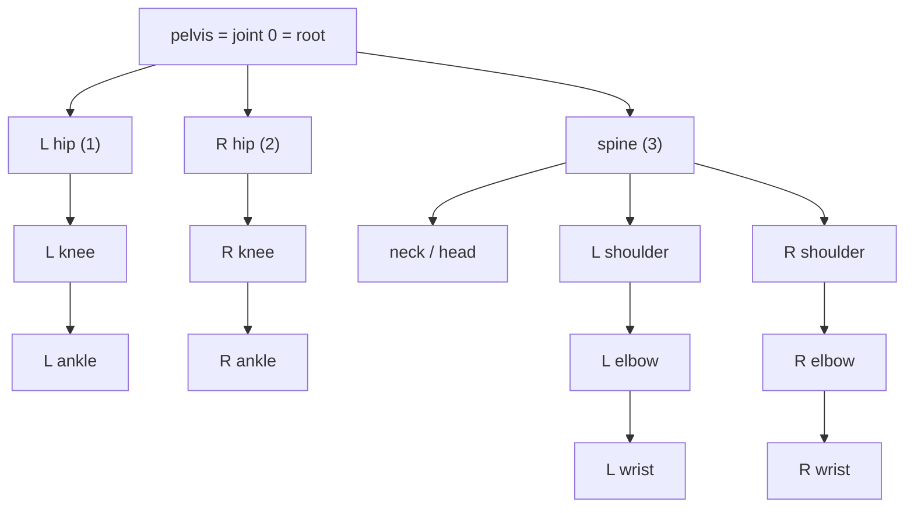
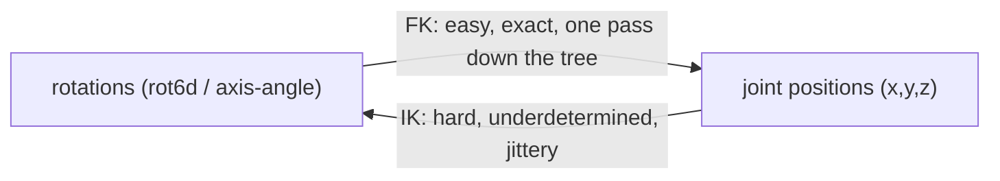

# Lesson 1 — A single pose: joints, skeletons, and the two languages of the body

> Goal of this chapter: understand what *one frozen instant* of a human body is, before we ever
> add time or text. Everything later (the 263 vector, rot6d, IK, why 22 joints) is built on this.

## 1.1 The body as a tree of joints

Hold your arm still for a second. Your hand is where it is because of a *chain*: shoulder → elbow →
wrist → hand. Move the shoulder and everything downstream moves with it. This is the single most
important idea in motion: **the body is a hierarchy (a tree), not a bag of independent points.**

**Definitions to note**
- **Joint** — a point where the body articulates (shoulder, elbow, knee…). In code it is just a 3D
  location plus, usually, a rotation.
- **Bone / segment** — the rigid link between a joint and its child (the upper arm connects shoulder
  to elbow). Bones have (roughly) **fixed length**.
- **Kinematic tree (skeleton)** — the parent→child hierarchy of joints. Every joint has exactly one
  parent except the **root**.
- **Root joint** — the top of the tree, usually the **pelvis**. It carries the body's overall
  position and facing in the world. Everything else is described *relative to its parent*.
  - *In our data this is exact:* SMPL-X **joint index 0 = pelvis = root** (verified in `feature.py`:
    `positions[:, 0]` is the root; chains are root-first; joint 1 = left hip, joint 2 = right hip).
    We keep `joints[:22]`, so the pelvis stays joint 0 throughout.
  - *Subtlety (foreshadows Lesson 3):* in the 263 vector the root is **not** stored as a position.
    It gets three dedicated channels — root **angular velocity**, root **ground-plane velocity**
    (x, z), and root **height** (y) — and joints 1–21 are stored **relative to the root**. This is
    why a clip's absolute heading and ground location are not numbers in the data at all.
- **Pose** — the configuration of the whole skeleton at **one instant in time**. (Motion, next
  lesson, is a sequence of poses.)



*The body is a tree rooted at the pelvis; a parent's rotation propagates to every descendant. That
inheritance down the tree is forward kinematics.*

## 1.2 The two languages for describing a pose

There are exactly two ways to write down a pose, and the whole project lives on knowing the
difference:

**Language A — positions ("where each joint is")**
List the 3D coordinates of every joint: `(x, y, z)` per joint. Also called *keypoints* or *joint
positions*. Intuitive, easy to plot. **Weakness:** nothing enforces bone length. A model that
outputs positions can accidentally stretch your forearm to 2 metres between frames — there is no
built-in constraint that elbow→wrist stays constant.

**Language B — rotations (precise version)**
For each joint, store a **local rotation**: how this joint's own coordinate frame is turned
**relative to its parent's frame**, measured as a change from a fixed **rest pose** (T-pose). The
root additionally stores a global position + global rotation (so the body can be placed and turned
in the world). **Strength:** bone lengths are fixed by construction — you only ever rotate rigid
bones, so the skeleton can never stretch. Preferred by animation, robotics, and motion *generation*.

> *Careful wording (a common trap):* it is **not** "rotate the parent's bone-arrow into the child's
> bone-arrow." A bone is a 1D direction; a rotation is a full 3D quantity. A direction cannot fix a
> rotation because the **twist around the bone's own axis** is left free (the same freedom that makes
> IK underdetermined). So we rotate a **frame relative to a frame**, not an arrow into an arrow.

**Definitions to note**
- **Rest pose (T-pose)** — a fixed reference configuration; every joint's frame has a known default
  orientation there, and all rotations are measured as a change *from* it.
- **Local (parent-relative) rotation** — the rotation re-orienting this joint's frame relative to its
  parent's frame. This is the number stored per joint.
- **World orientation** — where the joint points in the room; **computed**, not stored, by composing
  down the tree: `world(joint) = world(parent) ∘ local(joint)`. *That equation is forward
  kinematics.*

> *Intuition (your own arm):* bend your elbow 90° — that is the elbow's local rotation, relative to
> the upper arm. Now raise the whole arm at the shoulder: the forearm swings up too, yet the elbow's
> local rotation is unchanged (still 90°). The forearm moved in the world only because it
> **inherited** the shoulder's rotation through the chain. That inheritance is the payoff of
> "relative to parent."

**Definition to note**
- **Degrees of freedom (DoF)** — the number of independent values needed to specify the pose. A
  free rotation in 3D has 3 DoF. A body with J joints has roughly `3J` rotational DoF plus 3 for the
  root's position.

### 1.2b "Two languages" was a simplification — the honest picture (two separate axes)

A clarification worth keeping: *what you record* and *how you encode a rotation* are **different
choices**.

**Axis 1 — what you record about a pose:** positions, rotations, or a **hybrid**. Our
**HumanML3D-263 is a hybrid** — it stores positions AND rotations AND velocities AND foot-contact
flags in one vector (opened channel-by-channel in Lesson 3). So "two languages" is the conceptual
foundation; the representation we use is a deliberate *combination*.

**Axis 2 — how you encode a single rotation (several sub-languages):**
- **Euler angles** — 3 angles; intuitive but suffers *gimbal lock* and is discontinuous.
- **Axis-angle** — axis + angle (3 numbers). **SMPL / SMPL-X store this.**
- **Quaternion** — 4 numbers on a unit sphere; no gimbal lock; ideal for interpolation (*slerp*).
  Our `quaternion.py` math uses these.
- **Rotation matrix** — 3x3 (9 numbers), unambiguous but over-parameterised.
- **6D rotation (rot6d)** — first two matrix columns (6 numbers); third recovered by cross-product.
  **HumanML3D-263 stores joint rotations as rot6d.**

> **Paper observation — Zhou et al., 2019, "On the Continuity of Rotation Representations in Neural
> Networks."** Euler angles and quaternions are **discontinuous** as network outputs (a tiny real
> rotation can force a jump in the numbers), which networks learn poorly. Their **6D** representation
> is continuous — and this is exactly why HumanML3D-263 uses rot6d, and why our demo can read joint
> rotations straight off the model output.

> **Pipeline trace:** SMPL-X axis-angle (source) -> quaternions (`quaternion.py`, intermediate math)
> -> rot6d (stored in the 263) -> axis-angle again (demo, to drive the SMPL-X body). Three of the
> Axis-2 languages, used at different stages, for different reasons.

#### How rot6d works (concise)

A 3D rotation written as a **3x3 matrix** is three columns — each a unit vector saying where the x,
y, z axes land, all mutually perpendicular (9 numbers). The **3rd column is redundant**: given two
perpendicular axes, the third is forced (their cross product). So keep only the **first two columns =
6 numbers**. That is rot6d.

- **Encode:** rotation matrix -> drop column 3 -> store columns 1 and 2 (6 numbers).
- **Decode (Gram-Schmidt fix-up):** (1) normalize vector 1 -> axis 1; (2) subtract from vector 2 its
  overlap with axis 1, then normalize -> axis 2 (now perpendicular); (3) axis 3 = axis 1 x axis 2.
- **Why it wins:** a network can output *any* 6 numbers and the decode step always repairs them into
  a valid rotation -> no illegal outputs, no discontinuity (the Zhou et al. continuity result above).
- **In the 263:** 21 joints x 6 = **126 numbers** are exactly these rot6d rotations.

#### Gimbal lock (why Euler angles are avoided)

**Euler angles** describe a rotation as three turns about three nested axes (e.g. yaw, then pitch,
then roll), like a stack of three gimbal rings. **Gimbal lock** is when a middle turn lines two of
those axes up with each other: two rings now spin about the *same* direction, so you have **lost one
independent degree of freedom** — some real rotations become unreachable, and near that
configuration tiny real motions demand huge, jumpy changes in the angle numbers (the discontinuity).
Classic example: pitch the camera straight up 90 deg and "yaw" and "roll" suddenly do the same thing.
Rotation matrices, quaternions and rot6d have **no** gimbal lock; this is a core reason we never
store Euler angles.

> **Paper observation — SMPL (Loper et al., 2015).** The standard parametric human body model
> represents a pose as **axis-angle rotations, one per joint**, plus a small shape vector. This is
> Language B. SMPL-X (Pavlakos et al., 2019) extends it with hands and face. Our donor AMASS data is
> the SMPL-X release — so at the source, motion is stored as **rotations**, not positions.

## 1.2c The full logic, built on a 2-joint arm (the part that usually clicks)

Two bones — upper arm (length 30), forearm (length 25) — one shoulder, one elbow. Store **two
angles only**; lengths never change.

**Why store angles, not joint positions?**
1. *Angles match the true freedom.* The arm has 2 degrees of freedom (2 angles). Storing all joint
   positions = 4 numbers (redundant, most combos break bone lengths); storing only the hand = 2
   numbers but **ambiguous** (elbow-up vs elbow-down reach the same hand point). Angles = exactly the
   freedom, always legal, never ambiguous.
2. *You cannot break the skeleton.* Angles + fixed lengths means the arm is always exactly 55 long
   extended; no number can stretch it. "hand at (1000,0)" would be a 1000-long arm.
3. *The ML reason (thesis-relevant).* If the model **outputs rotations**, every output is a valid
   body in some pose. If it outputs **positions**, it must *learn* "bones don't stretch" from data and
   gets it slightly wrong -> rubber-limb glitches. This is why motion generators output rotations
   (our rot6d) and why we never need IK.

**Forward kinematics = a running accumulation down the chain.**
```
direction_so_far = 0;  position = (0,0)
direction_so_far += shoulder_angle      # bone 1: inherit nothing, add shoulder
position += 30 * (cos, sin)             #         -> elbow
direction_so_far += elbow_angle         # bone 2: inherit shoulder's turn, add elbow
position += 25 * (cos, sin)             #         -> hand
```
Each bone **inherits the accumulated turn of all ancestors, then adds its own**. That descent *is* FK
(our `raw_pose.py` / the SMPL-X body model).

**2D angle -> 3D rotation: only two things change.**
- A 3D turn needs more freedom (three independent axes) -> a *rotation*, not one angle (-> Axis 2).
- 3D turns **do not commute**: pitch-then-yaw a book =/= yaw-then-pitch (try it). So they combine by
  **composition** (a multiply), not addition, and order matters.
- The chain logic is identical: `rotation(joint) = rotation(parent) ∘ local_rotation(joint)` — same
  inherit-then-apply, with `∘` (compose) replacing `+` (add angle). Non-commutativity is *why* 3D
  rotation representations (quaternion, rot6d) are a real topic.

## 1.3 Moving between the two languages

The two languages are connected by two operations — and the names matter, because you keep meeting
them:

- **Forward Kinematics (FK): rotations → positions.** Start at the root, walk down the tree, apply
  each joint's rotation to its bone, and accumulate. Out come the 3D positions. FK is
  **deterministic and cheap** — one pass, one answer. (This is literally what the SMPL-X "body
  model" does: feed it rotations, it returns joint/vertex positions. It is `raw_pose.py` in our
  pipeline.)
- **Inverse Kinematics (IK): positions → rotations.** Given where the joints *are*, solve backwards
  for the rotations that put them there. IK is **hard**: it is *underdetermined* (a wrist position
  doesn't fix the forearm's twist — many rotations reach the same point), so it needs per-frame
  optimization and can produce jittery, popping joints.

> **Why this matters for us.** Because our data and our model both work in **rotations**, the demo
> can drive a skinned body by **FK** (easy, exact). We never need fragile IK. When I said earlier
> "no IK," this is exactly what I meant.



*Our data and our model both work in rotations, so we only ever need FK (the easy, exact direction) to
draw a body. We never need fragile IK.*

## 1.4 Coordinate frames (the quiet source of most bugs)

The same pose has different numbers depending on *what you measure it against*.

**Definitions to note**
- **World frame** — a fixed global coordinate system (origin on the floor, axes north/up/east).
  A joint's *world position* is where it is in the room.
- **Local / parent frame** — coordinates measured *relative to the parent joint*. A bone's rotation
  is naturally a *local* quantity.
- **Root-relative / body frame** — positions measured relative to the root, ignoring where the body
  is in the world. Useful when you care about the *motion shape*, not its location.
- **Up-axis convention** — which axis means "up". Some data is **Z-up** (AMASS), graphics is often
  **Y-up**. Mixing them flips the body on its back — a classic bug (we convert Z-up→Y-up in stage 1).

> **Paper observation — HumanML3D (Guo et al., CVPR 2022).** The field-standard representation we use
> deliberately stores motion in a **root-relative, facing-canonicalized** frame: every clip is
> re-centred to the origin and rotated to face the same direction. This is *why* (we will see next
> lesson) rotating or sliding a clip changes nothing — that information has been factored out on
> purpose.

## 1.5 What to hold onto from Chapter 1

1. The body is a **tree** rooted at the pelvis; children move with their parents.
2. A pose can be written as **positions** (where joints are) or **rotations** (how bones are angled).
   Rotations keep bone lengths fixed — that is why generation prefers them.
3. **FK** (rotations→positions) is easy; **IK** (positions→rotations) is hard and fragile.
4. Numbers only mean something relative to a **frame** (world vs local vs root-relative; Y-up vs Z-up).

---

### Questions to answer before Lesson 2 (reply in your own words)

1. If a model outputs **joint positions** and you train it badly, what physically impossible thing
   might happen to the skeleton — and which language would have prevented it?
2. Our SMPL-X data stores **rotations**. To *draw* a body on screen you need **positions**. Which
   operation converts one to the other, and is it the easy one or the hard one?
3. In your own words: why does it matter whether data is **Y-up** or **Z-up**?

### Looking ahead (Lesson 2 preview)
Lesson 2 turns a single pose into **motion**: sampling rate (fps), why 20 fps, velocity, and why a
sequence of poses is more than just "many poses". Lesson 3 then opens the actual **263 vector** and
shows where positions, rotations, velocities and foot-contacts each live inside it.
