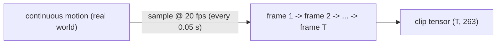
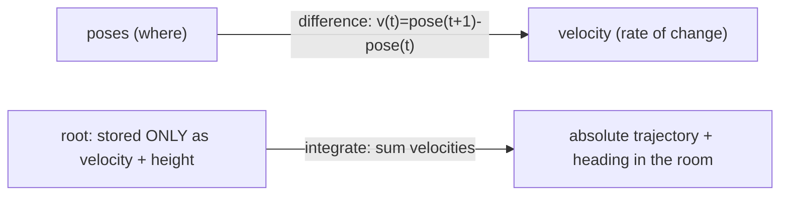

# Lesson 2 -- From a pose to *motion*: time, frame rate, and velocity

> Goal: turn one frozen pose (Lesson 1) into movement. We add the time axis, ask how finely to
> sample it, and meet velocity -- why a sequence of poses is more than "many poses".

## 2.1 Motion is a sequence of poses sampled in time

A single pose is the body frozen. **Motion** is a *list* of poses, one per **frame**, spaced evenly
in time. If a pose is a still photo, motion is a filmstrip.

**Definitions to note**
- **Frame** -- one pose at one instant.
- **Frame rate (fps)** -- how many frames per second we keep. 20 fps = one pose every 0.05 s.
- **Sampling** -- replacing continuous time with a finite grid of instants. The world moves
  continuously; we only ever *store samples* of it.
- **Sequence / clip** -- an ordered run of frames (in our data, 40-196 frames = 2-10 s at 20 fps).

So a motion clip is a tensor: `(T frames, per-pose numbers)`. In our case `(T, 263)`.

*Motion is continuous reality stored as evenly-spaced samples; the clip is a (T, 263) tensor at 20 fps.*

## 2.2 How finely must we sample? (why 20 fps is enough)

Mocap is captured at 60-120 fps; we **downsample to 20 fps**. Why is that not throwing away the
motion?

**Intuition (sampling bandwidth).** To capture a wiggle that repeats `f` times per second, you must
sample at least `2f` times per second -- sample slower and fast wiggles get *mis-recorded* as slow
ones (the wagon-wheel-spins-backwards effect). So your frame rate sets the **fastest motion you can
faithfully record**: 20 fps faithfully captures anything up to ~10 cycles/second.

**Why that is plenty for body motion.** Gross human body movement -- a step, a turn, a sit -- lives
*well below* 10 Hz. The extra 60-120 fps in mocap mostly captures sensor jitter and micro-vibration
at the body-joint level, not meaningful action. So 20 fps keeps the action and drops the noise -- and
it is the **field standard**, so our numbers stay comparable.

> **Where you are right (the honest limit).** Genuinely fast events -- a boxing jab's snap, the
> instant two hands clap -- *do* have high-frequency content that 20 fps cannot represent. That detail
> is lost **in the data**, before any model. Recovering it would need a higher-fps representation and
> retraining, not better rendering. Worth one honest sentence in the thesis.

> **Paper observation -- HumanML3D (Guo et al., 2022).** The standard pipeline resamples all motion to
> **20 fps**; every baseline (T2M-GPT, MoMask, Mogo) trains and reports at 20 fps. Choosing it is a
> comparability decision as much as a signal one.

## 2.3 Velocity: the rate of change between frames

**Definition to note**
- **Velocity** -- how much something changes per frame: `velocity(t) = pose(t+1) - pose(t)` (a finite
  difference). Position answers *where*; velocity answers *where to next, how fast*.

Velocity feels redundant -- it is just the difference of consecutive poses, so why store it? Three
reasons, and they matter for us:

1. **It is an inductive bias for smoothness.** Asking the model to also get the *velocity* right
   directly penalises jitter (frames that jump around) even when each individual frame looks
   plausible. Our training loss has an explicit **velocity term** for exactly this.
2. **For the root, velocity *is* the representation.** Recall from Lesson 1: we do **not** store the
   pelvis's absolute position. We store its **velocity** (ground-plane + turn rate) and reconstruct
   the global trajectory by **integration** -- adding up the per-frame velocities. (This is the
   machinery that makes a clip's absolute location "not a number in the data".)
3. **It carries dynamics.** Two clips can pass through the *same* pose while one is rising and one is
   falling. The pose is identical; the velocity is opposite. Velocity is what distinguishes them.

**Definition to note**
- **Integration** -- the inverse of velocity: `position(t) = position(0) + sum of velocities up to t`.
  We integrate the root's stored velocity to place the body in the world at render time.

*Velocity is the difference of consecutive poses; the root is stored as velocity and **integrated** back
to place the body in the world -- which is why absolute position is not a number in the data.*

## 2.4 Why a sequence is MORE than "many poses"

This is the conceptual jump of Lesson 2. A pose model and a motion model are different animals:

- **Temporal coherence.** Frame `t+1` must be *consistent* with frame `t`: feet that were planted
  should not teleport, limbs should not flicker. Independent good poses do **not** make good motion --
  stitched without coherence they jitter.
- **Foot sliding (foot skate).** The classic motion artifact: the body translates while a "planted"
  foot slides across the floor like ice. Each frame looks fine; the *sequence* is wrong. Our data
  carries explicit **foot-contact flags** (4 of the 263 numbers) and the training loss has a
  **foot term** precisely to fight this.
- **Dynamics / momentum.** Real motion has continuity of velocity (you cannot reverse direction
  instantly). A model that ignores time can produce physically impossible accelerations.

> **Paper observation -- foot contacts (Guo et al., 2022).** HumanML3D includes binary heel/toe
> contact labels in the feature vector specifically so models can learn *when a foot is grounded* and
> avoid foot-skate. It is a small but load-bearing 4 numbers.

## 2.4b Design sidebar: "can we sample per action / raise fps?" (a defense answer)

A natural idea: different actions move at different speeds, so give each action category its own
frame rate (e.g. in YAML). **This breaks the model** -- and knowing *why* is a clean defense point.

> **Rule -- temporal resolution must be consistent within one representation.** "One frame = 0.05 s"
> must mean the same for *every* clip, because the velocity channels, foot-contact logic, the
> tokenizer's /4 downsample, the generator's per-step prediction, and the **frozen Guo evaluator**
> all assume a single fixed fps. Mixing fps per clip makes "the next frame" mean different durations
> for different clips -> incoherent velocity/dynamics, and meaningless FID (evaluator is locked at
> 20 fps).

The valid versions of the instinct (none mix fps within a model):
- **Per-track fps, already in config:** `Hml3dReprCfg.fps = 20` (citable) vs `SmplxAvatarCfg.fps =
  30` (SMPL-X demo). One consistent rate per whole model -- the right granularity.
- **Uniform higher fps as an ablation:** train one model entirely at 30 fps, report as a *separate*
  table (loses 20-fps baseline comparability, so it cannot replace the citable run).
- **The demo may run higher fps than the citable model** (no evaluator constraint) -- this is where
  "finer granularity for fast actions" belongs.
- **Ceiling:** raising fps only recovers detail up to the **mocap native rate (60-120)**; beyond
  native, extra frames are pure interpolation = no new information.

What actually limits the **range of actions** is the **data**, not fps: HumanML3D's caption
vocabulary (locomotion, sits, jumps, kicks, punches, waves, dance) is what text can steer; fine hand
manipulation, object interaction, sports technique and multi-person are thin or absent. More range =
more/different captioned data, not a different sampling rate.

## 2.5 What to hold onto from Lesson 2

1. Motion = poses **sampled** on a time grid; our clip is `(T, 263)` at **20 fps**.
2. Frame rate caps the **fastest motion you can record** (~half the fps); 20 fps keeps body action,
   drops jitter, and matches the field.
3. **Velocity** = change per frame. It is stored to enforce smoothness, to represent the root (which
   is **integrated** back to a trajectory), and to carry dynamics.
4. A sequence is **more than many poses** -- temporal coherence, foot-contact, and momentum only exist
   across frames. This is *why we need a motion model, not a pose model.*

---

### Questions to answer before Lesson 3

1. Our mocap is 120 fps; we keep 20 fps. In one sentence, what *kind* of motion is safely dropped,
   and what *kind* would be genuinely lost?
2. Velocity is "just" `pose(t+1) - pose(t)`. Give one reason we still store it explicitly instead of
   letting the model infer it.
3. "Foot skate" is when each single frame looks correct but the clip is wrong. Why can a pure
   **pose** model never detect this, while a **motion** model can?

### Looking ahead (Lesson 3 preview)
Lesson 3 finally opens the **263 vector** and shows exactly where each thing from Lessons 1-2 lives:
root velocity + height (4), joint positions / ric (63), joint rotations / rot6d (126), local
velocities (66), foot contacts (4) -> 263. Everything you have learned will map to a slice of that
vector.
