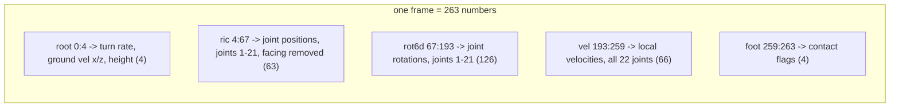
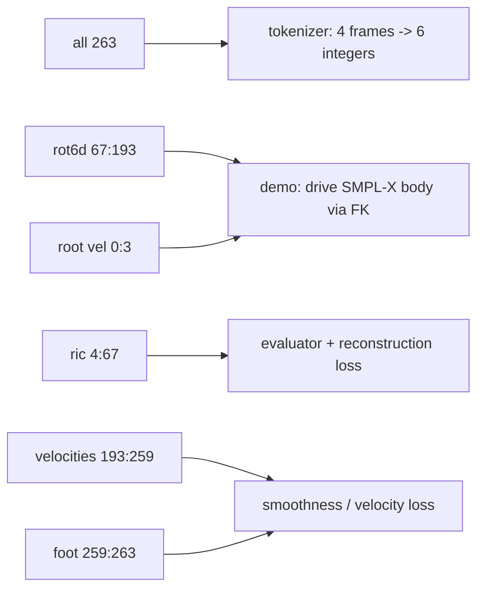

# Lesson 3 -- Opening the 263 vector, slice by slice

> Goal: map everything from Lessons 1-2 onto the actual numbers. After this you can point at any of
> the 263 channels and say what it is, why it exists, and which concept it came from.
> Layout verified in `feature.py` (the `data = concatenate(...)` block).

## 3.0 The picture

*One frame is these five blocks concatenated: 4 + 63 + 126 + 66 + 4 = 263. The root is velocity +
height (not absolute position); ric and rot6d skip the pelvis, so they count 21 joints, not 22.*

## 3.1 The exact layout (per frame, 22 joints)

| Slice | Size | Name | Language (Lesson 1) |
|------:|-----:|------|---------------------|
| `[0:1]`     | 1   | root **angular** velocity (turn rate about vertical) | rotation / velocity |
| `[1:3]`     | 2   | root **linear** velocity (ground plane x, z)         | velocity |
| `[3:4]`     | 1   | root **height** (y)                                  | position |
| `[4:67]`    | 63  | **ric**: joint positions, joints 1-21, root-relative | positions (A) |
| `[67:193]`  | 126 | **rot6d**: joint rotations, joints 1-21              | rotations (B) |
| `[193:259]` | 66  | **local velocities**, all 22 joints                  | velocity |
| `[259:263]` | 4   | **foot-contact** flags (2 left, 2 right)             | contacts |

`1 + 2 + 1 + 63 + 126 + 66 + 4 = 263`.

## 3.1a What "ric" means (read this before the table)

**ric = Rotation-Invariant Coordinates** -- joint *positions* (Language A) measured in a frame where
the body's **facing direction is removed**. From the code's `get_rifke` ("rotation-invariant forward
kinematics").

*Picture:* a camera mounted behind the pelvis that **always turns to face the way the body faces**.
Filmed by it, "walk north" and "walk east" look **identical** -- same limbs, only the heading
differed, and the camera cancelled the heading. That is rotation-invariant: spin the whole body about
the vertical axis and these numbers do not change.

> **Definition to note -- ric:** 3D positions of joints 1-21 in the pelvis-following, facing-cancelled
> frame (numbers `[4:67]`). They say "where the limbs are relative to the body," never "which way the
> body points in the room."

*Why it is the clever part:*
1. The model learns each action **once**, not once per compass direction ("walking" is one pattern in
   ric space). The heading is handled separately by the root angular-velocity channel `[0]`.
2. It is exactly **why yaw-rotating or sliding a clip changes no numbers**: facing is divided out of
   ric, and absolute position was never stored (only root velocity). A rotated clip yields identical
   ric.

*Three different "where" concepts, now distinct:* root velocity `[0:3]` = how the **pelvis moves**;
root height `[3]` = how high the pelvis sits; ric `[4:67]` = the **other joints relative to the
pelvis, facing removed**. World position/facing is not stored -- integrate the root velocity to get it.

## 3.1b Which value belongs to which joint (the "which is which" map)

22 joints, indexed 0-21, **pelvis = joint 0 = the root**. Key idea: the pelvis is the **reference
frame** (a camera the body carries) -- you record *how it moves* and *its height*, and everything
else *relative to it*. So the pelvis cannot be measured against itself: it is absent from the
position and rotation blocks.

| Block | Index range | Which joints | Per joint |
|------|------------|--------------|-----------|
| root (pelvis) | `[0:4]`     | **joint 0 only** | `[0]` turn rate * `[1:3]` ground velocity * `[3]` height |
| ric positions | `[4:67]`    | joints **1-21** (21) | 3 numbers, pelvis-relative |
| rot6d rotations | `[67:193]`| joints **1-21** (21) | 6 numbers |
| local velocities | `[193:259]` | **all 22** (0-21) | 3 numbers |
| foot contacts | `[259:263]` | foot joints | 4 binary flags |

- The pelvis is NOT in ric/rot6d because in its own frame its position is the origin and its rotation
  is already the angular-velocity channel `[0]`. That is why ric/rot6d count **21 joints, not 22**.
- Read joint k's position (k = 1..21): `[4 + (k-1)*3 : 4 + (k-1)*3 + 3]`. Left hip (joint 1) = `[4:7]`.
- Absolute pelvis x/z and facing are NOT stored -> recover by integrating `[0]` and `[1:3]`.

## 3.2 Reading it (each block ties back to a concept)

**Root block `[0:4]` -- the body's "where + facing", as velocity + height.**
Note what is *absent*: no absolute x, z position, no absolute heading. Only the **turn rate**,
**ground-plane speed**, and **height**. To place the body in the world you **integrate** the turn
rate to get facing and the linear velocity to get the trajectory (Lesson 2). *This is the mechanism
behind "rotating or sliding a clip changes nothing" -- absolute pose was never stored, only its rate
of change.*

**ric `[4:67]` -- joint positions (Language A), root-relative.**
The 3D locations of joints 1-21 in the root's own frame (root excluded -- it sits at the origin
here). 21 joints x 3 = 63. Easy to plot, easy for losses and the evaluator to consume directly.

**rot6d `[67:193]` -- joint rotations (Language B).**
The local rotation of each of joints 1-21 as the continuous 6-number code from Lesson 1 (root
rotation excluded -- it is the angular-velocity channel). 21 x 6 = 126. **This is the slice the demo
reads to drive the SMPL-X body** (rot6d -> axis-angle -> FK).

**local velocities `[193:259]` -- per-joint change per frame (Lesson 2).**
All 22 joints, 3 each = 66. Smoothness / dynamics signal; the training velocity loss leans on this.

**foot contacts `[259:263]` -- when feet are grounded.**
4 binary flags (heel/toe x left/right) from a velocity threshold. The anti-foot-skate signal
(Lesson 2); the loss has a dedicated foot term.

## 3.3 The deliberate redundancy (an important insight)

The 263 stores joint **positions (ric)** *and* joint **rotations (rot6d)** *and* their
**velocities** -- and these are mathematically redundant (rotations + FK give positions; consecutive
positions give velocity). Why pay for all of it?

- **Positions (ric)** are what the **evaluator and reconstruction loss** read most directly, and what
  the recovery function (`recover_from_ric`) uses to draw joints.
- **Rotations (rot6d)** are what **drives a real articulated body** without stretching bones (the demo
  path), and what generation prefers (Lesson 1).
- **Velocities** are the **smoothness/dynamics** hints (Lesson 2).
- **Foot contacts** are the **grounding** hint (Lesson 2).

So the 263 is exactly the **hybrid representation** from Lesson 1.2b: it refuses to choose one
language and instead gives the model (and the evaluator) every view at once, each cheap to compute,
each useful to a different consumer. The redundancy is a feature, not waste.

## 3.3a Who reads which slice (the system view)

*The redundancy is deliberate: different consumers read different slices -- positions for the
evaluator, rotations for the body, velocities/contacts for the losses.*

## 3.4 Where the 263 sits in the whole system

- The **tokenizer** eats `(T, 263)` and compresses 4 frames -> 6 integers (Contribution A).
- The **generator** is trained to produce token sequences that decode back to `(T, 263)`.
- The **evaluator** reads `(T, 263)` (re-normalized to its Comp_v6 stats) to compute FID / R-prec.
- The **demo** reads slice `[67:193]` (rot6d) for body pose and `[0:3]` (root velocities) for the
  trajectory.

Everything in this project is, ultimately, this 263-number frame moving through different modules.

## 3.4b How we KNOW the 263 is correct (the misinterpretation fear)

Misreading a slice (wrong order, units, frame, up-axis) silently poisons everything and is invisible
to "the loss went down". We validate on a ladder of independent checks, each ruling out a different
failure:

1. **Byte-faithful port** (rules out wrong layout/order): `feature.py` is ported
   constant-for-constant from Guo's official HumanML3D code -> each slice means what the reference
   says it means.
2. **Finiteness + range** (rules out NaN / dead / mis-scaled channels): 0 non-finite, 0 missing
   across splits; normalized mean ~0.03, std ~1.03, std min 0.014.
3. **Round-trip = 0** (rules out non-invertible packing): `recover_from_ric(process_file(joints))`
   vs original -> **L1 = 0.0000**. Exercises the **root + ric (position)** path.
4. **Cross-path agreement** (rules out rot6d vs position inconsistency): `recover_from_ric`
   (positions) and `recover_from_rot` (rot6d + FK) must rebuild the *same* skeleton -> validates the
   **rot6d** block against the position block.
5. **External oracle** (rules out any semantic/unit/order misread): the frozen Guo evaluator (a
   trained net expecting a specific format) reproduces published GT numbers on our 263 -> R@1 0.514
   vs 0.511, Diversity 9.67 vs 9.50, MM-Dist 2.977 vs 2.974; and our per-channel **Mean correlates
   0.99997** with the official eval stats.

**External (paper) proof of the layout.** The 263 spec is **Guo et al., CVPR 2022** (HumanML3D),
re-documented identically across follow-ups (e.g. MotionStreamer, arXiv:2503.15451). Published
composition: `4 root + (J-1)*3 ric + (J-1)*6 rot6d + J*3 vel + 4 foot`; for J=22 -> 4+63+126+66+4 =
263 -- block-for-block equal to our `feature.py` slices `[0:4] [4:67] [67:193] [193:259] [259:263]`.
Our code header names the exact ported file (`.../HumanML3D/blob/main/motion_representation.ipynb`),
so we match the standard *by construction*; the frozen Guo evaluator reproducing published metrics on
our data confirms it *behaviorally*.

> **Definitions to note.** *Round-trip test* = encode then decode and check you get the input back
> (proves invertibility/self-consistency). *External oracle* = an independent, pre-trained component
> that only produces sensible output on correctly-formatted input (proves semantics without trusting
> your own code).

**Residual + the cure:** numbers settle correctness; they do not settle intuition. The cheapest
decisive check is to **visualize** a recovered clip for a known caption and watch it -- correct
trajectory (root velocity), planted feet (contacts + ric), correct bends (rot6d) all at once. The
aitviewer demo is therefore also the final validation instrument, not only a deliverable.

## 3.4c "Why not model rot6d only, positions for loss?" (a real research axis)

A natural idea: model the minimal pose (rot6d) and use ric positions only in the loss. Two honest
layers:

**We already do a version of it.** The generator predicts **discrete tokens**, not 263 floats; the
position/velocity/foot channels enter mainly as **loss terms** (soft-decode geometric losses). So
"model the compact thing, supervise with positions" is the spirit of our loss design already. The
narrow open question is only "what should the **tokenizer** encode -- all 263 or rot6d-only?".

**The literature trade-off (well documented, two-sided):**
- *Rotation-only*: preserves bone lengths, but FK error **accumulates down the chain** (small spine
  error -> large hand error) and per-joint loss weights all joints equally (QuaterNet, Pavllo et al.,
  arXiv:1805.06485).
- *Position-only*: direct, no chain accumulation, but breaks bone lengths -> needs re-projection.
- *263 hybrid*: keeps both deliberately, plus velocity (smoothness) and foot (grounding).
- *Frontier goes the OTHER way*: "Absolute Coordinates Make Motion Generation Easy" (Meng et al.,
  arXiv:2505.19377) argues HumanML3D's local-relative pelvis modeling causes global **drift** and that
  **absolute** joint coordinates help -- i.e. *more* explicit position info, not less. Plus a known
  critique that HumanML3D's rotations are IK-derived and the root uses only a 1-scalar Y-axis
  angular velocity.

**Our stance:** the **citable track keeps 263** (the frozen evaluator consumes it -> comparability is
non-negotiable). A rot6d-only tokenizer is a valid, cheap **ablation** (expected *worse* recon-FID:
evaluator reads positions + FK accumulation), reportable as a negative row. Novelty stays in the
tokenizer/generator; representation choice (rotation vs position vs absolute) is an active separate
axis we cite but do not claim to settle.

## 3.5 What to hold onto

1. 263 = root(4) + ric positions(63) + rot6d rotations(126) + local velocities(66) + foot(4).
2. The **root is velocity + height, not absolute position** -> integrate to place in the world.
3. The vector is a **deliberate hybrid**: positions for the evaluator, rotations for the body,
   velocities for smoothness, contacts for grounding.
4. Different modules read different slices; the demo reads **rot6d** to animate SMPL-X.

---

### Questions before Lesson 4

1. The root block stores velocity and height but **not** absolute x/z position or heading. What must
   you *do* to those velocity channels to actually place the body in the room?
2. The vector stores both ric (positions) and rot6d (rotations) for the joints, which is redundant.
   Give one consumer that prefers **positions** and one that prefers **rotations**.
3. Which single slice does the demo read to pose the SMPL-X body, and why that one and not ric?

### Looking ahead (Lesson 4 preview)
Lesson 4: why 263 floats per frame is too much for a generator to predict directly, and how the
**tokenizer** (Contribution A) turns that continuous vector into a few discrete integers -- the bridge
from "motion representation" to "a model that generates motion".
