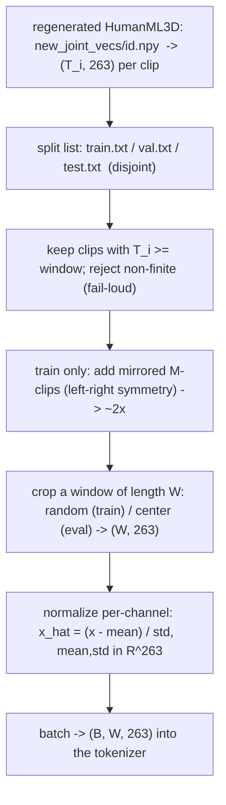

# Lesson 4a — The data pipeline: from regenerated clips to a training batch

> A methods chapter (sits between representation, Lesson 3, and tokenization, Lesson 4). It defines how
> raw HumanML3D-263 clips become normalized, augmented, leakage-free batches — the part examiners probe
> when they ask "did you use all the data?", "are the splits clean?", "how do you know it's not
> memorising?". Grounded in `motion_window.py` (and the shared `Mean.npy`/`Std.npy` regeneration).

## 4a.0 The picture (with shapes)

## 4a.1 What the pipeline must guarantee

Four properties, each a place a thesis silently breaks if ignored:
1. **Rectangular batches** — the conv encoder downsamples by a fixed factor, so every sample must be
   the same length $W$ (a multiple of `downsample`).
2. **No leakage** — train / val / test must be disjoint, and *augmentation must touch train only*
   (else the held-out metric is contaminated and the generalization audit of Lesson 7 is meaningless).
3. **No poison** — a single NaN/Inf clip corrupts gradients invisibly; these are rejected loudly.
4. **Reproducibility** — cropping is seeded so a run is repeatable.

## 4a.2 Source and layout

Each clip is a regenerated HumanML3D-263 array `new_joint_vecs/<id>.npy` of shape $(T_i, 263)$ — the
exact vector dissected in Lesson 3. Per-channel statistics $\mu,\sigma\in\mathbb{R}^{263}$ live in
`Mean.npy`/`Std.npy` and are **shared** by the tokenizer and the text dataset (one normalization for
the whole system). The split membership lists are `train.txt` / `val.txt` / `test.txt`.

## 4a.3 Normalization

Each channel is standardized to zero mean / unit variance using the precomputed statistics:
$$
\hat{x}_{t,c} = \frac{x_{t,c} - \mu_c}{\sigma_c},\qquad c = 1,\dots,263,
$$
with the exact inverse `denormalize`: $x = \hat{x}\,\sigma + \mu$. Per-channel (not global) matters
because the 263 blocks live on wildly different scales — root height (metres), rot6d (unit-ish),
foot flags ($\{0,1\}$); a single global scale would let the large-variance channels dominate the L1
loss. (Audit from Lesson 3: normalized mean $\approx 0.03$, std $\approx 1.03$.)

## 4a.4 Windows

The tokenizer trains on fixed-length crops (the T2M-GPT/MoMask recipe). For a window $W$ and clip
length $T_i$, the overflow is $T_i - W$; a **random** start is drawn on train (data augmentation +
coverage), a **centered** start on val/test (deterministic, comparable):
$$
\text{start} = \begin{cases} \mathrm{Uniform}\{0,\dots,T_i-W\} & \text{train} \\ \lfloor (T_i-W)/2 \rfloor & \text{val/test} \end{cases},
\qquad \text{window} = \hat{x}[\text{start}:\text{start}+W].
$$
Random cropping means each epoch sees a *different* slice of each clip — the model sees far more than
one window per clip over 500 epochs, so "we use all the data" is literally true (every clip $\ge W$ is
in memory and re-sampled).

## 4a.5 Mirror augmentation (the symmetry map)

Human motion is (approximately) left-right symmetric: a valid motion reflected across the body's
sagittal plane is another valid motion. The mirror map $\mathcal{M}$ acts on the 263 vector by
**swapping left/right joint channels** and **negating the lateral (medial-axis) components** of
positions, rotations, and velocities (and swapping the left/right foot-contact flags). Applied to the
training set it (nearly) **doubles** it for free. In our pipeline $\mathcal{M}$ is precomputed during
regeneration and materialized as `M`-prefixed clips, so the loader simply *includes both* `id` and
`Mid` — **but only on the train split** (`self._mirror = mirror_augment and split == "train"`). Val
and test are never mirrored, so the augmentation cannot leak into evaluation.

## 4a.6 Splits and hygiene

- **Disjoint splits** (23 384 / 1 460 / 4 384 base names); the loader de-duplicates the `M` prefix so a
  base clip and its mirror are treated as one identity for membership.
- **Length filter:** clips shorter than $W$ are dropped (cannot form a window).
- **Fail-loud finiteness:** any non-finite clip raises with the offending ids — no silent skipping
  (a NaN clip would otherwise poison gradients undetected).
- **Cache-once:** every kept clip is loaded to memory a single time; normalization and cropping happen
  at access, so there are no per-step disk reads.
- **Seeded RNG** for the random crop -> reproducible runs (Lesson on determinism).

## 4a.7 Why this underwrites the claims

- The **train-only mirror + disjoint splits** are precisely what make the Lesson 7 generalization
  audit valid: test recon-FID measures generalization because nothing from test (or its mirror) was
  ever trained on.
- **Full-data use** (all clips $\ge W$, random crops, mirror) directly addresses the prior project's
  plateau lesson ("only a fraction of the data was used").
- **Per-channel normalization + fail-loud hygiene** are why the loss is comparable across the 263
  heterogeneous channels and why "the loss went down" can be trusted.

> **Bottom line:** the pipeline turns variable-length, heterogeneous clips into fixed-length,
> per-channel-normalized, mirror-augmented, leakage-free batches $(B, W, 263)$ — rectangular for the
> conv encoder, honest for the held-out metrics, and reproducible by seed. Every property here is a
> precondition for a number later in the thesis to mean what it claims.
