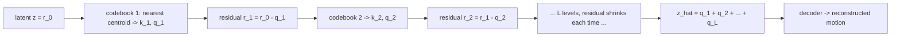

# Lesson 5 — RVQ: turning motion into tokens with a learned codebook (the baseline)

> Beginner theory of the **strong-RVQ baseline tokenizer**, with the mathematics at each step.
> Framing: quantization is how the analog world becomes digital; VQ generalizes it to vectors and is
> exactly **online k-means**. Numbers confirmed in Lesson 7. Code: `rvq_baseline.py`,
> `tokenizer_trainer.py`. (Math in LaTeX — view in a KaTeX/MathJax-capable markdown preview.)

## 5.1 The problem
Motion is **continuous** (the 263 floats per frame). A next-token generator needs **discrete**
tokens. A tokenizer learns to map motion $\to$ a few integers and back. RVQ does the discrete step.

## 5.2 Vector Quantization = nearest-centroid (the digital-signal idea, for vectors)
Recall how a continuous audio signal is digitized: each sample is replaced by the nearest value from
a finite set of **reproduction levels**. **Vector Quantization (VQ)** is the same idea for vectors:
the reproduction levels become a set of representative vectors — a **codebook** — which are exactly
**cluster centroids** (as in k-means).

The encoder produces a latent $z \in \mathbb{R}^{d}$; the codebook is
$C = \{e_1,\dots,e_K\}$, $e_k \in \mathbb{R}^{d}$ (the $K$ centroids). **Quantize** = assign $z$ to
its nearest centroid:

$$
k^\star = \arg\min_{k}\,\lVert z - e_k\rVert_2,
\qquad q(z) = e_{k^\star},
\qquad \text{token} = k^\star .
$$

The decoder reconstructs $\hat{x} = \text{Decoder}\!\big(q(z)\big)$, trained against the input $x$
with $\mathcal{L}_{\text{recon}} = \lVert x - \hat{x}\rVert_1$ (L1 — Lesson A: avoids L2 blur).

**Definitions to note**
- **Codebook** — the $K$ learned centroids $e_k$.
- **Quantization** — assign $z$ to its nearest centroid (a Voronoi partition of $\mathbb{R}^d$).
- **Token** — the index $k^\star$ of that centroid.

## 5.3 Training VQ — three problems, each with its math

**Problem 1 — $\arg\min$ has no gradient.** The assignment $k^\star$ is piecewise-constant, so
$\partial q/\partial z = 0$ almost everywhere and the encoder cannot learn. **Fix — Straight-Through
Estimator (STE):**

$$
z_q = z + \operatorname{sg}\!\big(e_{k^\star} - z\big),
$$

where $\operatorname{sg}(\cdot)$ is stop-gradient. Forward $z_q = e_{k^\star}$ (discrete); backward
the $\operatorname{sg}$ term contributes nothing, so $\partial z_q/\partial z = 1$ — the gradient is
**copied straight through** to the encoder.

**Problem 2 — centroids and encoder must agree.** The VQ-VAE objective:

$$
\mathcal{L} = \mathcal{L}_{\text{recon}}
\;+\; \underbrace{\lVert \operatorname{sg}(z) - e_{k^\star}\rVert_2^{2}}_{\text{codebook loss}}
\;+\; \beta\,\underbrace{\lVert z - \operatorname{sg}(e_{k^\star})\rVert_2^{2}}_{\text{commitment}} .
$$

In practice the **codebook loss is replaced by an EMA update** (more stable — it *is* online
k-means). With decay $\gamma$ (we use $0.99$) and $n_k$ = number of latents assigned to centroid $k$
this batch:

$$
N_k \leftarrow \gamma N_k + (1-\gamma)\,n_k, \qquad
m_k \leftarrow \gamma m_k + (1-\gamma)\!\!\sum_{i:\,k_i = k}\!\! z_i, \qquad
e_k \leftarrow \frac{m_k}{N_k}.
$$

So only the **commitment** term $\beta\,\lVert z - \operatorname{sg}(e_{k^\star})\rVert_2^2$ stays in
the loss (our $\beta = 0.02$); the codebook moves by EMA, not gradient.

**Problem 3 — codebook collapse.** Many centroids end with $N_k \approx 0$ (never assigned).
**Fix — dead-code reset:** when a centroid falls below a threshold $\tau$, reinitialise it to a
random encoder output from the batch:

$$
\text{if } N_k < \tau:\quad e_k \leftarrow z_j,\quad j \sim \text{Uniform(batch)} .
$$

A *healthy* VQ thus needs **STE + commitment + EMA + dead-code reset**. (T2M-GPT measured the stakes:
naive VQ recon-FID $0.49$ vs EMA+reset $0.07$ — a $7\times$ gap.)

## 5.4 RVQ = quantize the residual, recursively (coarse-to-fine)

*Each level quantizes what the previous one missed; early levels capture gross structure, later levels
add detail. Tokens = the L chosen indices.*

One codebook of moderate $K$ is too coarse. **Residual VQ** applies $L$ quantizers, each to the
*leftover error* of the previous. With $r_0 = z$, for $l = 1,\dots,L$:

$$
k_l = \arg\min_{k}\,\big\lVert r_{l-1} - e_k^{(l)}\big\rVert_2,
\qquad q_l = e_{k_l}^{(l)},
\qquad r_l = r_{l-1} - q_l,
$$

$$
\hat{z} = \sum_{l=1}^{L} q_l = z - r_L,
\qquad \text{tokens} = (k_1,\dots,k_L).
$$

Each level shrinks the residual, $\lVert r_l\rVert < \lVert r_{l-1}\rVert$ — early levels capture
gross structure, later levels add detail. The effective vocabulary is $K^{L}$ combinations from $L$
small codebooks. **Quantization dropout:** with some probability keep only the first $L' < L$ levels
in a step, so the model degrades gracefully.

## 5.5 How WE do it (applied — `rvq_baseline.py`)
The strong, competitive recipe (T2M-GPT + MoMask + EnCodec defaults):
- $L = 6$ levels $\times\, K = 512$ centroids, code dim $512$;
- EMA $\gamma = 0.99$, dead-code reset, commitment $\beta = 0.02$, quant-dropout $0.2$;
- **shares the conv encoder/decoder** with the FSQ tokenizer (width 512, downsample 4, 3 resblocks),
  so FSQ-vs-RVQ differs *only* in the quantizer.

Training step (`tokenizer_trainer.py`): encode a normalized 64-frame window $\to$ 6-level residual
quantize $\to$ decode; loss $\mathcal{L}_{\text{recon}} + \beta\cdot\text{commitment}$; backward
(STE), AdamW, weight-EMA for eval; $\sim 500$ epochs; best by downstream recon-FID.

## 5.6 Health, with math (preview; values in Lesson 7)
Per codebook, with usage probabilities $p_k = n_k / \sum_j n_j$:

$$
\text{perplexity} = \exp\!\Big(\!-\!\sum_k p_k \log p_k\Big)\ \ (\text{effective centroids in use}),
\qquad
\text{usage\_frac} = \frac{\lvert\{k : n_k > 0\}\rvert}{K}.
$$

Healthy RVQ: $\mathcal{L}_{\text{recon}}$ falling, perplexity/usage high (held up by dead-code reset),
commitment small and stable. Collapse $\Rightarrow$ usage crashes; drift $\Rightarrow$ commitment grows.

## 5.7 Research lineage
VQ-VAE (van den Oord et al., 1711.00937) — learned-codebook quantization + STE + commitment;
SoundStream (2107.03312) / EnCodec (2210.13438) — RVQ as the audio-codec standard; T2M-GPT
(2301.06052), MoMask (2312.00063) — VQ/RVQ for motion. Our baseline follows them exactly.

### Check before Lesson 6
1. Write the STE identity for $z_q$ and explain why its backward pass is the identity.
2. In RVQ, what does codebook $l$ quantize, and what happens to $\lVert r_l\rVert$ as $l$ grows?
3. The codebook is updated by EMA, not gradient. Which loss term remains, and what is its job?
