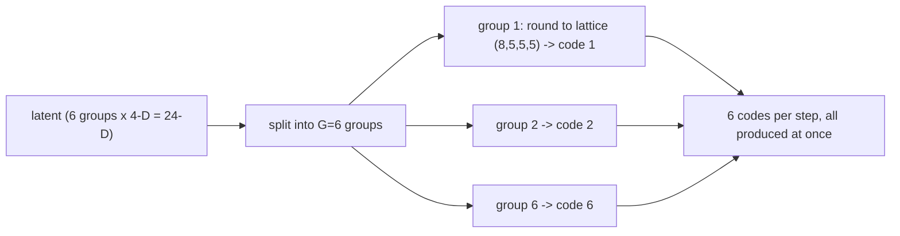
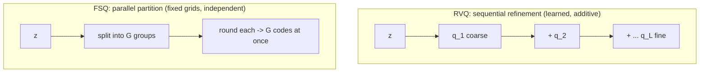
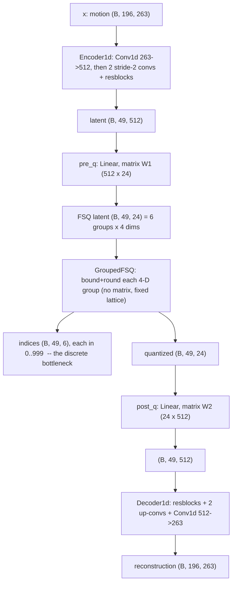

# Lesson 6 — FSQ: turning motion into tokens with a fixed grid (our tokenizer)

> Mirror of Lesson 5, for the **Grouped-FSQ tokenizer (Contribution A)**. Same beginner framing:
> what it is, how it is trained, why it needs almost no machinery, how we apply it. Values in
> Lesson 7. Code: `tokenizer.py`, `tokenizer_trainer.py`. Research: FSQ (Mentzer), ScaMo.

## 6.1 The same problem, a different answer
We still need continuous motion $\to$ discrete tokens. VQ (L5) *learned centroids* and searched for
the nearest. **FSQ instead rounds onto a fixed integer lattice** — no centroids, no search, no
learning of the quantizer at all.

## 6.2 Finite Scalar Quantization: rounding onto a fixed lattice (the math)
Take a small latent $z \in \mathbb{R}^{d}$ (here $d = 4$ per group). Give each dimension $i$ a fixed
number of **levels** $L_i$ (e.g. $(8,5,5,5)$). Quantize each dimension independently — bound, then
round:

$$
\text{half}_i = \frac{L_i - 1}{2},
\qquad
\hat{z}_i = \operatorname{round}\!\big(\text{half}_i \cdot \tanh(z_i)\big),
\qquad
\text{idx}_i = \hat{z}_i + \text{half}_i \in \{0,\dots,L_i-1\}.
$$

The single token index is the **mixed-radix** combination of the per-dimension indices:

$$
\text{index} = \sum_i \text{idx}_i \prod_{j<i} L_j
\ \in\ \Big\{0,\dots,\textstyle\prod_i L_i - 1\Big\},
\qquad \prod_i L_i = 8\cdot5\cdot5\cdot5 = 1000.
$$

No nearest-neighbour search and **no stored vectors** — the "codebook" is the fixed lattice, never
materialised. (Implementation detail: the exact bound adds a small even/odd shift so the levels
straddle zero correctly — see `FSQ.bound` in `tokenizer.py`; the essence is $\tanh$-bound then round.)

**Definitions to note**
- **Levels $L_i$** — allowed values per latent dimension.
- **Implicit codebook** — $\prod_i L_i$ ($=1000$); implied by the lattice, never stored.

## 6.3 Training FSQ — the math is "STE only"
Same autoencoder: encoder $\to z \to$ round-to-lattice $q(z) \to$ decoder. The only
non-differentiable op is $\operatorname{round}$, handled by the **same STE** as VQ:

$$
z_q = z + \operatorname{sg}\!\big(q(z) - z\big),
\qquad
\mathcal{L} = \mathcal{L}_{\text{recon}}.
$$

Every VQ training term **vanishes**, and here is exactly why:
- **commitment** $\beta\lVert z - \operatorname{sg}(e)\rVert^2$ $\to$ there is no learned $e$ to
  commit to (the lattice is fixed);
- **codebook loss / EMA** $\to$ there are no centroids to move;
- **dead-code reset** $\to$ unused lattice points are coordinates with **zero parameters**; nothing
  collapses, nothing to reinitialise.

So FSQ training $=$ **reconstruct $+$ STE**. That radical simplicity (no collapse to babysit) is the
practical argument for FSQ.

## 6.4 Grouped-FSQ (ours): partition the latent into groups

*Six parallel groups, each rounded to its own fixed lattice — 6 codes per step (same budget as RVQ's
6 levels), but produced simultaneously with no search and no learned codebook.*

A single small FSQ latent is too low-dimensional to represent 263-D motion (we learned this the hard
way — the residual-FSQ variant collapsed at recon-FID 0.22). **Fix:** split the latent into **G = 6
groups**, FSQ each group independently -> **6 codes per token step** (the same token budget as RVQ's
6 levels, for a fair comparison; and a wide-enough 6x4 = 24-D latent).

> Contrast with RVQ (Lesson 5): RVQ's 6 codes are **sequential refinement levels** (learned,
> additive); FSQ's 6 codes are **parallel partition groups** (fixed grids, independent). One learns
> and refines, the other partitions and rounds.

## 6.4a RVQ vs FSQ, side by side

*Same token budget, opposite mechanism: RVQ learns centroids and refines a residual step by step; FSQ
partitions the latent and rounds every group in parallel. This is the independent variable in the
Lesson 7 comparison.*

## 6.5 How WE do it (applied — `tokenizer.py`)
- **6 groups x (8,5,5,5) = 1000** codes/group; **shares** the conv encoder/decoder with RVQ (same
  width/downsample/resblocks) so the comparison isolates the quantizer.
- **Training loop** (same `tokenizer_trainer.py`): encode -> round -> decode; loss = **reconstruction
  L1 (+ velocity)** only — **commit is structurally 0**; AdamW + weight-EMA (eval smoothing, generic,
  not a codebook EMA); ~500 epochs; best by downstream recon-FID.
- Logs the same two tiers; a healthy FSQ shows `recon` falling, `perplexity`/`usage_frac` high, and
  **`commit 0.0000`** (the on-screen proof of "no machinery").

## 6.6a Discrete capacity: how much can the tokens hold, and how we choose G

### Shape-annotated dataflow (every matrix, with dimensions)

Shapes for the recommended `tok_g6_v1000` ($\text{width}=512$, $\text{downsample}=4$, $G=6$ groups,
levels $(8,5,5,5)\Rightarrow$ FSQ dim $4$, latent $6\times4=24$). The only learned matrices in the
quantizer path are $W_1\in\mathbb{R}^{512\times24}$ (`pre_q`) and $W_2\in\mathbb{R}^{24\times512}$
(`post_q`); FSQ itself has **no parameters**. Everything the decoder ever sees passes through the
integer tensor `indices` $(B,49,6)$ — that is the whole channel.

### The capacity formula

A token **step** is one downsampled position (covers $\text{downsample}=4$ frames). Per step:
$$
\text{codes/step}=G,\quad \text{vocab/code}=V=\prod_i L_i,\quad
\boxed{\ \text{distinct tuples/step}=V^{G},\qquad \text{bits/step}=G\log_2 V\ }.
$$
For $G=6$, $V=1000$: $\text{bits/step}=6\log_2 1000 \approx 59.8$, $V^G = 1000^{6}=10^{18}$ tuples
**per step**. A 196-frame clip $\to 49$ steps $\to 49\times6=294$ integers $\to 49\times59.8\approx
2930$ bits, i.e. $\sim 2^{2930}$ distinguishable motions. Capacity for *variety* is never the binding
constraint; per-step *fidelity* is.

### Is that "enough"? — rate-distortion, not an absolute

"Enough" is meaningless in isolation; it is defined against distortion. The input per step is
$4\times263=1052$ floats; we compress it to $36$–$80$ bits — a $\sim\!400\text{–}900\times$ lossy
compression. How much is lost is the **recon-FID**, and the curve recon-FID vs bits/step **is** the
rate-distortion curve — the Lesson 7 matrix sweeping codes/step $\{4,6,8\}$ is exactly that
measurement:
$$
\text{4 codes} \approx 0.053\text{–}0.063 \;\to\; \text{6 codes} \approx 0.028\text{–}0.034
\;\to\; \text{8 codes} \approx 0.020\text{–}0.028,
$$
monotone with diminishing returns, reaching MoMask's $\approx0.019$ ceiling at 8 codes. We pick the
**knee**: where extra bits stop materially lowering recon-FID. So the answer to "are 4 integers
enough?" is empirical — at 4 codes there is visible residual; by 8 codes the reconstruction is at the
reference ceiling.

### Effective vs nominal capacity (perplexity)

$V^G$ is the *nominal* capacity; the *usable* capacity is the number of codes actually exercised,
$\exp(-\sum_k p_k\log p_k)$ (perplexity, Lesson 5.6). FSQ reaches $\sim\!100\%$ lattice usage by
construction, so effective $\approx$ nominal; RVQ needs dead-code reset to avoid wasting its codebook.
That fuller effective capacity is a core reason FSQ wins at *matched nominal bits*.

### Why not just maximise G

More codes/step is not free downstream: the generator predicts $G$ codes **per step** through $G$
parallel heads (Lesson 8), so larger $G$ enlarges the per-step joint space and the model, making
generation harder. Hence the frozen tokenizer is chosen by recon-FID **and** downstream gen-FID — the
smallest $G$ that neither bottlenecks reconstruction nor overloads the generator.

## 6.6 Research lineage
FSQ (Mentzer et al., 2309.15505) showed fixed-grid quantization matches learned VQ with ~100% code
usage and none of the machinery; ScaMo (2412.14559) confirmed FSQ > VQ on motion. Our contribution is
the **Grouped-FSQ formulation on HumanML3D-263 + the controlled head-to-head vs strong RVQ**.

### Check before Lesson 7
1. FSQ skips commitment, codebook-EMA and dead-code reset. For each, say in one phrase WHY it isn't
   needed.
2. What single piece of machinery does FSQ still share with VQ, and what is it for?
3. Why grouped (6 parallel groups) instead of one small FSQ latent or a residual stack?
