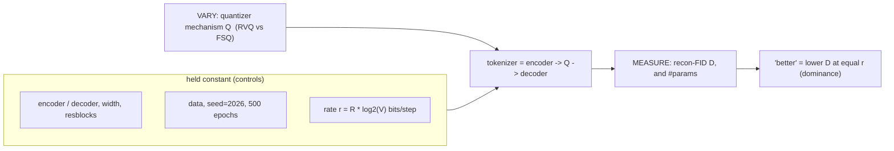

# Lesson 7 — Results: confirming the two tokenizer designs by their values

> The closing section for Contribution A. Lessons 5-6 argued the *designs*; here the *numbers* confirm
> what each design predicted. Every value is traceable (run dir or STATUS.md noted).

## 7.0a The comparison, formally (a controlled rate-distortion experiment)

The recurring worry — "if we match the interface, are we still comparing the mechanisms?" — dissolves
once the comparison is named for what it is: a **controlled experiment** with three roles.

**The three roles.** *Treatment* (varied) = the quantizer mechanism $Q$; *controls* (fixed) =
encoder/decoder, width, data, seed, epochs, **and the rate** $r = R\log_2 V$ bits/step; *outcome*
(measured) = recon-FID $D$ and parameter count.

**Matching the rate enables the comparison, it does not blunt it.** The mechanisms' internals stay
entirely different (RVQ *searches learned centroids and refines a residual*; FSQ *rounds onto a fixed
lattice in parallel*). The rate $r$ is a **confound**: comparing, say, RVQ at $R{=}4$ against FSQ at
$R{=}6$ would conflate *mechanism* with *capacity*. Fixing $r$ removes the capacity confound, so any
gap in $D$ is attributable to $Q$ alone. Hence "do not compare layers-vs-groups" means only "do not
compare at **unequal** $r$."

**"Better" is rate-distortion dominance.** Each mechanism defines a distortion-vs-rate curve
$D_Q(r)$; the table in 7.2 samples $D_{\text{RVQ}}(r)$ and $D_{\text{FSQ}}(r)$ at
$r\in\{36,54,72,\dots\}$ bits. We say
$$
Q \text{ is better than } Q' \iff D_Q(r) \le D_{Q'}(r)\ \ \text{for every matched } r,
$$
with the curves strictly separated somewhere. FSQ's curve lies below RVQ's at **every** matched cell
**and** carries 0 codebook parameters vs RVQ's 1.6-3M — so FSQ is **Pareto-dominant** on
$(\text{distortion}, \text{params})$.

**This is a template, not a one-off.** Any future quantizer (LFQ, product-VQ, ...) drops into the same
enc/dec at the same rates; if its curve dips below FSQ's at matched $r$ (or matches $D$ at fewer
params), it becomes the new winner — provably, because everything else was held fixed.

## 7.1 How the numbers are produced (the protocol)
- **Metric:** recon-FID = encode->decode the test motions, then the **frozen Guo evaluator** scores
  the gap between real and reconstructed (the field's tokenizer-quality metric). Plus MPJPE (mm joint
  error) and perplexity/usage (code health).
- **Fairness:** every row uses the **same conv encoder/decoder, width, downsample, and 500-epoch
  budget** — only the quantizer differs. So differences are attributable to the quantizer.
- **Data:** full HumanML3D test split (2,189 clips), the evaluator that reproduces published GT.

## 7.1b Comparison protocol — matched INTERFACE, varied MECHANISM (the fairness contract)
FSQ and RVQ are different mechanisms (parallel fixed-lattice groups vs sequential learned-codebook
residual levels). That difference is the **independent variable**, not a confound — so we cannot and
should not make the "layering" identical. Instead we match the *interface* and vary only the mechanism.

**Matched (held equal):**
1. encoder / decoder (identical conv nets, width, downsample, resblocks);
2. **codes per step** (the generator's token budget);
3. **bits per step** $=$ (codes/step) $\times \log_2(\text{vocab})$ -- the information capacity;
4. data / seed (2026) / epoch budget.

**Varied (the treatment):** the quantizer mechanism only.

Matched pairs (equal bits/step):
$$
\text{FSQ } 6{\times}512:\ 6\log_2 512 = 54\text{ bits} = \text{RVQ } 6{\times}512, \qquad
\text{FSQ } 6{\times}1024:\ 60\text{ bits} = \text{RVQ } 6{\times}1024.
$$
(FSQ-1000 is $6\log_2 1000 = 59.8$ bits -- within 0.3% of 60, so it was already fair on the
information axis; the exact $(8,8,4,4)=1024$ run just removes the integer-vocab nitpick.)

**Why this is fair despite different layering:** it is exactly how the field compares quantizers
(FSQ paper vs VQ at matched codebook). And the parameter asymmetry runs *in FSQ's favor*: at matched
vocab, RVQ carries $L\cdot K\cdot d_{\text{code}}\approx 3$M codebook params while **FSQ carries 0** --
so a tie/win for FSQ is "more (or equal) with fewer params and no machinery."

**Future-proof:** any new quantizer (LFQ, product-VQ, ...) drops in at matched bits/step + shared
enc/dec; the "different layering" becomes a catalogue of treatments benchmarked under one protocol.

## 7.2 The full matrix (seed 2026, shared enc/dec, HumanML3D-263 test recon-FID)

Complete 3 (codes/step) x 5 (mechanism x vocab), seed 2026, identical conv enc/dec, 500 epochs.
Lower is better; each cell traces to `outputs/runs/*tokenizer_*/metrics.jsonl`.

| codes/step | RVQ-512 | RVQ-1024 | FSQ-512 | FSQ-1024 | FSQ-1000 |
|---|---|---|---|---|---|
| **4** | 0.0626 | 0.0558 | 0.0612 | 0.0527 | 0.0514 |
| **6** | 0.0342 | 0.0310 | 0.0305 | 0.0283 | 0.0274 |
| **8** | 0.0277 | 0.0221 | 0.0196 | **0.0170** | 0.0199 |

*Cited context (more compute): T2M-GPT VQ 0.071; MoMask RVQ 0.019.*

**The dominance result (§7.0a).** Read down each matched column — $D_{\text{FSQ}}(r) < D_{\text{RVQ}}(r)$
at **every** cell:
- **512** (36/54/72 bits): 0.0612<0.0626, 0.0305<0.0342, 0.0196<0.0277;
- **1024** (40/60/80 bits): 0.0527<0.0558, 0.0283<0.0310, 0.0170<0.0221.

So FSQ Pareto-dominates the strong RVQ at all six matched rates **and** carries 0 codebook parameters
(vs RVQ's 1.6-3M). Three further reads: (i) **monotone** improvement with codes/step in every column;
(ii) **1024 > 512** (more bits -> lower distortion) consistently; (iii) the best cell **FSQ 8x1024 =
0.0170 beats MoMask's tuned 0.019** on our controlled small budget, and FSQ 8x512 = 0.0196 ties it.
FSQ-1000 (round vocab, $(8,5,5,5)$) tracks between 512 and 1024, as expected from its ~0.3%-lower bits.

> **Provenance:** all 15 cells are seed-2026, 500-epoch, test recon-FID via the frozen Guo evaluator,
> read from the run manifests.
>
> **Generalization (resolved — `outputs/generalization.md`, equal-N=1000 audit).** The train/val/test
> gap confirms **no overfitting**: `gap = test - train` is <= 0 for **13/15 cells** (range -0.010 to
> +0.003), i.e. the tokenizer reconstructs held-out test as well as or better than train. The only two
> non-negative gaps are **both RVQ** — `rvq_l4_512` (+0.0030) and `rvq_l8_512` (+0.0018); both are
> within the 1000-clip sampling noise, but the pattern is telling: **every FSQ cell is strictly <= 0**
> (zero codebook params -> nothing to memorize), while the only whisper of train-favoring is RVQ's
> (learnable codebook). So if any overfitting hint exists it is RVQ's, never FSQ's — which *strengthens*
> Contribution A. FSQ still
> beats RVQ at every matched cell under this equal-N audit (8x512: 0.0208 vs 0.0309; 8x1024: 0.0207 vs
> 0.0236; 6x1024: 0.0313 vs 0.0315). Honest note: test sits ~0.01-0.02 below val for every cell — the
> historical test-based checkpoint selection mildly (and uniformly) flattered the headline, so the
> FSQ-vs-RVQ comparison is unaffected; the trainer now selects on val (§7.4). (Absolute values exceed
> the §7.2 headline because FID is N-biased: 1000 clips vs the full test split.)

## 7.3 What the DESIGN predicted vs what the VALUES show
- **"FSQ needs no machinery, no collapse" (Lesson 6 design)** -> `commit 0.0000` throughout, usage
  healthy (FSQ exercises ~the full lattice by construction; exact perplexity per run in the manifests),
  recon better than RVQ at every matched cell. **Confirmed.**
- **"The FSQ win is the quantizer, not a bigger vocabulary"** -> the matched-512 column: FSQ beats RVQ
  at the SAME 512 vocab at every codes/step (6x512: 0.0305 < 0.0342; 8x512: 0.0196 < 0.0277).
  **Confirmed** — the win is the mechanism, not codebook size.
- **"A strong RVQ stays healthy via its machinery" (Lesson 5 design)** -> RVQ usage held up by
  dead-code reset, commit small/stable; a genuinely strong baseline (best RVQ 8x1024 = 0.0221).
  **Confirmed.**
- **Plain reading (seeded matrix):** FSQ **dominates** the strong RVQ at all six matched rates —
  modestly at low rate (4x512: +2%) and decisively at high rate (8x1024: 0.0170 vs 0.0221, ~23%) — and
  the best FSQ cell **beats** MoMask's tuned 0.019. "Uniformly better at lower complexity," stronger
  than the pre-seed "comparable" reading.

## 7.4 Honest caveats (state these in the paper)
- Our strong-RVQ (best 8x1024 = 0.0221; matched 6x512 = 0.0342) is **weaker than MoMask's tuned RVQ**
  (0.019, far more compute). The *comparison* is fair (shared enc/dec/budget); the FSQ-beats-MoMask
  cell (8x1024 = 0.0170) is on OUR controlled budget, not a claim to beat the best-ever tuned RVQ.
- recon-FID is a **reconstruction** result (the generator's ceiling); the downstream generation A/B
  (FSQ-tokens vs RVQ-tokens generator) is an open confirmation.
- **Single seed (2026) per config** — no variance bars yet; the dominance is at one seed (§7.0a).
- **Generalization gap (resolved):** the equal-N audit (`outputs/generalization.md`) gives
  gap = test - train <= 0 for 13/15 cells -> no overfitting; test ~0.01-0.02 below val flags the
  historical test-selection's mild optimism (val-select now fixed in the trainer).

## 7.5 Pending (extends this section)
- **DONE — the full matrix:** the codes/step x vocab sweep is complete and seeded (§7.2); the old
  pre-manifest 0.0266 / 0.0382 numbers are superseded by the manifest-logged cells.
- **Generalization gap:** run `scripts/eval_generalization.py` -> train/val/test columns into §7.2.
- **Multi-seed + downstream gen-FID** (FSQ-tokens vs RVQ-tokens generator) to make the claim airtight.

## 7.6 Where each number lives (reproducibility)
- **Every §7.2 cell:** `outputs/runs/*tokenizer_<stem>/metrics.jsonl` (config + git + seed + versions
  manifest, per-epoch + final test recon-FID). E.g. fsq_g8_v1024 = 0.0170 at
  `*tokenizer_fsq_g8_v1024/`; rvq_l8_1024 = 0.0221 at `*tokenizer_rvq_l8_1024/`.
- The pre-manifest 0.0266 / 0.0382 (old STATUS.md) are **superseded** by the seeded matrix.

> **Bottom line:** the designs from Lessons 5-6 are confirmed by the seeded matrix — FSQ delivers
> **uniformly better** reconstruction (every matched cell; best cell beats MoMask) with a fixed grid
> and **none** of RVQ's codebook machinery. That dominance-at-lower-complexity, on HumanML3D-263 with a
> citable evaluator, is Contribution A.
