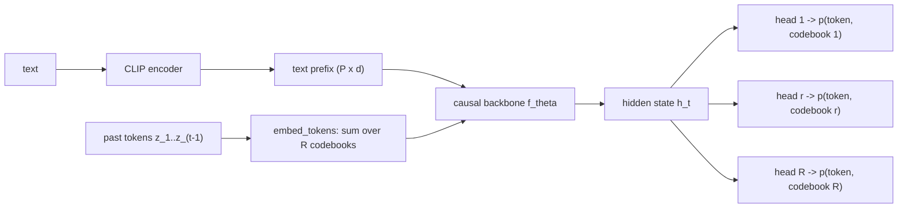

# Lesson 8 -- The autoregressive generator: text into a distribution over tokens

> Opening of Contribution B. Lessons 5-7 built the *tokenizer* (motion <-> a grid of discrete codes).
> Now we model the codes. This lesson defines the **probabilistic object** the generator is -- the
> objective that **both twins optimise identically**. Lessons 11 (transformer) and 12 (Mamba) are
> then *only two implementations of the function $f_\theta$ in this lesson*; lesson 13 is a property
> of that function's state. Every equation here is grounded in `src/text2motion/model/generator.py`.

## 8.0 The picture

*Causal in time, parallel across the R codebooks: $h_t$ depends only on the past, then fans out to $R$
independent heads. Lessons 11 and 12 only swap the box "f_theta"; everything else is fixed.*

## 8.1 What we are modelling

The frozen tokenizer maps a motion to a grid of integers
$$
z \in \{0,\dots,K-1\}^{T\times R},
$$
where $T$ is the number of (4x-downsampled) frames, $R$ is the number of codebooks per step
(`num_codebooks`, $=$ codes/step from Lesson 7), and $K$ is the per-codebook vocabulary
(`codebook_size`). A caption gives a condition $c$. The generator is the conditional distribution
$$
p_\theta(z \mid c).
$$
Sampling from it and decoding the tokens (frozen decoder) yields motion. Training fits $\theta$.

## 8.2 The factorisation -- causal in time, parallel across codebooks

A grid has $T\cdot R$ entries; modelling the joint directly is intractable, so we factor it. The
chain rule **in time** gives the autoregressive (causal) structure, and the implementation predicts
the $R$ codebooks of a single step **in parallel from a shared hidden state** -- i.e. conditionally
independent *given the history*:
$$
p_\theta(z \mid c) \;=\; \prod_{t=1}^{T}\;\prod_{r=1}^{R} p_\theta\!\big(z_t^{\,r}\;\big|\;z_{<t},\,c\big),
\qquad z_{<t} := (z_1,\dots,z_{t-1}).
$$
Read it precisely: across **time** the model is strictly causal ($z_t$ may see only the past); across
the **$R$ codebooks of the same step** there is no inner ordering $z_t^{<r}$ -- they share one
hidden state $h_t$ and are read out by $R$ parallel heads (sec. 8.4). This is a deliberate modelling
choice (`MotionGenerator.logits` stacks $R$ independent heads): it makes a step a single parallel
prediction (cheap, streaming-friendly) at the cost of not modelling intra-step residual ordering the
way a masked bidirectional model (MoMask) would. State the trade-off; do not hide it.

## 8.3 Conditioning: text as a prefix

The text encoder (CLIP) produces $P$ conditioning vectors, projected to the model width:
$$
c \in \mathbb{R}^{P\times d_{\text{text}}}
\;\xrightarrow{\;W_{\text{text}}\;}\;
\tilde c = W_{\text{text}}\,c \in \mathbb{R}^{P\times d_{\text{model}}},
\qquad P=\texttt{text\_prefix\_len}
$$
(`text_prefix`, with a hard shape assert that $P$ matches the encoder). The prefix is consumed
**once**, before any motion token. For the transformer twin it stays in the KV-cache; for Mamba it is
absorbed into the fixed-size recurrent state -- the bounded-memory story of lesson 13 starts here.

## 8.4 Embedding, the shared state, and the heads

Each codebook $r$ has its own embedding table $E_r$; the $R$ tokens of a step are **summed** into one
$d_{\text{model}}$ vector (`embed_tokens`):
$$
e(z_t) \;=\; \sum_{r=1}^{R} E_r\big(z_t^{\,r}\big) \;\in\; \mathbb{R}^{d_{\text{model}}}.
$$
A causal backbone $f_\theta$ (the swappable part -- transformer or Mamba) turns the prefix and the
embedded history into a hidden state, and $R$ linear heads produce per-codebook logits:
$$
h_t \;=\; f_\theta\big(\tilde c,\; e(z_1),\dots,e(z_{t-1})\big)\in\mathbb{R}^{d_{\text{model}}},
\qquad
\ell_t^{\,r} \;=\; W_r\,h_t \;\in\;\mathbb{R}^{V},\quad
p_\theta(z_t^{\,r}\mid z_{<t},c)=\mathrm{softmax}(\ell_t^{\,r}).
$$
Here $V = K + 1$ when an END token is used (sec. 8.8). **Everything model-specific lives inside
$f_\theta$**; sec. 8.4 is identical for both twins. That is what makes the comparison controlled.

## 8.5 Training: teacher forcing + the cross-entropy anchor

During training the *true* tokens are fed and the model predicts the next step at every position
(teacher forcing). Concretely (`MotionGenerator.forward`) the input sequence is the prefix followed
by the ground-truth tokens shifted by one,
$$
\text{seq\_in} = \big[\,\tilde c_1,\dots,\tilde c_P,\; e(z_1),\dots,e(z_{L-1})\,\big],
$$
and the hidden states from position $P\!-\!1$ onward predict $z_1,\dots,z_L$. The anchor loss is the
mean cross-entropy over codebooks, masked to the valid (unpadded) length $L_b$
(`token_ce_loss`):
$$
\mathcal{L}_{\text{CE}}
= -\,\frac{1}{R}\,\frac{\sum_{b}\sum_{t\le L_b}\sum_{r}\log p_\theta\!\big(z_{b,t}^{\,r}\mid z_{b,<t},c_b\big)}
{\sum_b L_b}.
$$
This is the **anchor**, not the whole loss: the full recipe adds a soft-decode reconstruction term
(decode the predicted tokens through the frozen decoder and penalise geometry/velocity/foot error) --
that is Lesson A and the training-protocol chapter. Here, $\mathcal{L}_{\text{CE}}$ defines *what
"predict the next token" means* mathematically.

## 8.6 Sampling: why non-greedy

At inference the future is unknown, so we sample step by step. Greedy decoding
($\arg\max$) collapses to a few repeated motions -- the documented T2M-GPT failure mode. We use
**temperature + nucleus (top-$p$)** sampling (`sample_logits`). With temperature $\tau$,
$$
\tilde p^{\,r}_v = \frac{\exp(\ell^{\,r}_v/\tau)}{\sum_{u}\exp(\ell^{\,r}_u/\tau)},
$$
then keep the smallest high-probability set $\mathcal{S}$ whose mass first exceeds $p$, renormalise,
and sample within it:
$$
\mathcal{S} = \Big\{\text{top codes until }\textstyle\sum \tilde p \ge p\Big\},\qquad
z_t^{\,r} \sim \frac{\tilde p^{\,r}_v\,\mathbb{1}[v\in\mathcal{S}]}{\sum_{u\in\mathcal{S}}\tilde p^{\,r}_u}.
$$

## 8.7 Classifier-free guidance (CFG)

To sharpen text adherence we train *both* a conditional and an unconditional model in one network:
with probability $p_{\text{drop}}$ the condition is replaced by a null condition (zeroed text,
matching `stream`'s `torch.zeros_like(text_emb)`). At inference we extrapolate the two logit vectors
(`stream`, `cfg_scale > 1`):
$$
\ell^{\text{cfg}} \;=\; \ell_{\varnothing} \;+\; s\,\big(\ell_{c} - \ell_{\varnothing}\big),\qquad s\ge 1.
$$
$s=1$ is plain conditional sampling; $s>1$ pushes mass toward text-consistent codes. Both rows
($c$ and $\varnothing$) run in **one batch of size $2B$**, so the streaming state stays bounded -- CFG
costs a constant factor, not growing memory.

## 8.8 The END token and length

With `use_end_token`, the vocabulary is $V=K+1$ and the extra id marks "stop." Two protocols, both
reported: the **fixed-length** eval masks END ($\ell_{\text{END}}\!=\!-\infty$) so generation runs to
the GT length (comparable to the literature); the **self-terminating** mode stops when every row
emits END, giving the model its own length. The tokenizer must never decode the END id.

## 8.9 What the values show (grounded, and honestly partial)

The math above predicts that **CFG and non-greedy sampling matter**. On the 31.6M *pilot* generator
(validation split, 300 clips; traceable to `outputs/cfg_sweep.log`), locking $s=5$ moved
$\mathrm{FID}\ 6.14\!\to\!3.55$ ($-42\%$) and R@1 $0.105\!\to\!0.22$ ($\times 2.1$), with the
temperature/top-$p$ pair fixed at $(\tau,p)=(1.1,0.9)$. These confirm the sampling theory on the
pilot. **They are not the thesis result**: the 100M transformer-vs-Mamba twin at matched
params/data/seed is the run that produces the citable numbers, and it is still pending. Stated plainly
so an examiner sees exactly which claims are evidenced and which are forthcoming.

## 8.10 Why this lesson is the hinge

Everything downstream is a special case of sec. 8.1-8.7:
- **Lesson 11 (transformer)** and **Lesson 12 (Mamba)** only replace $f_\theta$ in sec. 8.4 -- same
  objective, same heads, same loss, same sampler. The comparison is controlled *because* of this.
- **Lesson 13 (streaming)** is the statement that $f_\theta$ admits a recurrence
  $h_t = g_\theta(h_{t-1}, e(z_{t-1}))$ whose state size is constant (Mamba) or growing (transformer
  KV) -- a property of $f_\theta$, read off this same forward pass.
- **Lesson 14 (metrics)** scores samples drawn by sec. 8.6-8.7.

> **Bottom line:** the generator is one conditional distribution $p_\theta(z\mid c)$, factored
> causally in time and in parallel across codebooks, fit by masked next-token cross-entropy, and
> sampled with temperature/nucleus + classifier-free guidance. The architecture debate (Contribution
> B) is *only* about which $f_\theta$ computes $h_t$ -- and at what streaming cost.
