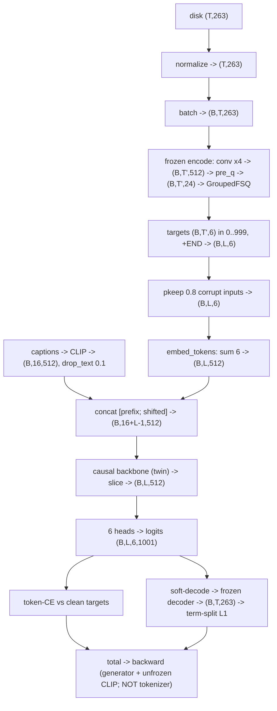

# Lesson 9 — The training trace: every transformation a value suffers

> Follow ONE motion clip from disk to the loss, value by value, with exact shapes. This IS the
> architecture, shown concretely. Symbols: B = batch (e.g. 64), T = frames (<=196), T' = T/4 token
> steps (downsample 4), 263 feat dims, 512 width, 6 groups x 4 = 24 latent, 1000 codes/group,
> 16-token text prefix. Code: dataset.py, tokenizer.py, generator.py, trainer.py, losses.py.

## The picture (shapes end to end)

## Stage 0 — on disk
`new_joint_vecs/<id>.npy` -> **(T, 263)** float32. Each value is a physical-ish channel (root
velocity rad/frame or m/frame, ric m, rot6d unitless, vel m/frame, foot {0,1}). Lesson 3 layout.

## Stage 1 — load + normalize (dataset.py)
1. **crop to the caption's segment** (alignment): HumanML3D stores `caption#tokens#start#end`; when
   start/end are nonzero the caption describes only a sub-span, so crop the motion to
   $[\text{start}\cdot\text{fps} : \text{end}\cdot\text{fps}]$ so text and motion describe the same
   thing (start=end=0 -> whole clip). *This is for CORRECTNESS, and can use LESS of a clip per visit.*
2. **window to <=196 frames** (budget + use-all-data): 196 = 9.8 s @ 20 fps = HumanML3D's max
   (comparability + bounded compute; /4 -> <=49 token steps). Clips longer than 196 are not dropped
   but **windowed** — random slice in train (augmentation), leading slice in eval (deterministic).
   -> **(T, 263)**, T <= 196.
3. `(x - Mean) / Std` per channel -> **(T, 263)**, now ~N(0,1). *Each value shifted & scaled to unit
   variance so no channel dominates the loss (units differ wildly).*

> **Data coverage — what we USE vs what we HAVE (a defense point).**
> - *Cropping* is alignment, not coverage — it can use only the captioned span.
> - *Window-not-drop* is the coverage maximizer — it recovers long clips (random windows -> most
>   frames seen across epochs).
> - **Within HumanML3D:** ~96% of the official train split used (~22,418 / 23,384; only sub-40-frame
>   dropped), x2 mirror, random windows + random caption choice -> essentially all of HumanML3D.
> - **But NOT all the data we physically have:** AMASS (151 GB, 16,407 seqs) is unused on the
>   captioned generator *by design* (no captions; non-standard pairs would break FID comparability);
>   Inter-X / ARCTIC / PAHOI unused. The AMASS **pretraining corpus** (13,249 seqs -> 5.8 MB token
>   pack, E7b) is built but **not yet trained on** — the single biggest untapped legitimate data
>   lever (the prior project's plateau was blamed partly on "used <10% of the 290 GB").

## Stage 2 — batch (collate_pad)
Stack + zero-pad to batch max -> motion **(B, T, 263)**, lengths **(B,)**, captions list.

## Stage 3 — FROZEN tokenizer ENCODE: motion -> tokens (tokenizer.py)
1. **Encoder1d**: transpose -> (B, 263, T); two stride-2 convs **downsample time x4** + resblocks ->
   (B, 512, T/4); transpose -> **(B, T', 512)**. *Transformation: 4 frames of 263 numbers become 1
   latent of 512 — temporal compression + feature mixing.*
2. **pre_q** linear: (B, T', 512) -> **(B, T', 24)**. *Project to the FSQ latent (6 groups x 4-D).*
3. **GroupedFSQ**: split into 6 groups of 4-D; per group: `bound` (squash to the grid range) ->
   `round_ste` (snap to nearest (8,5,5,5) lattice point) -> `codes_to_indices`. Output
   **target_tokens (B, T', 6)** integers in 0..999. *Transformation: continuous 24-D -> 6 discrete
   integers per step. THE discretization.* (no grad to the tokenizer — it's frozen.)

## Stage 4 — build targets + corrupt inputs (trainer.py)
1. **END token**: append END at each clip's last step -> **(B, T'+1, 6)** targets.
2. **pkeep 0.8**: copy targets to inputs, randomly replace ~20% of INPUT ids with random codes ->
   **input_tokens (B, T'+1, 6)**. *Targets stay clean; only the teacher-forcing inputs are corrupted
   (fights exposure bias).*

## Stage 5 — text branch (text_encoder.py + trainer.py)
captions -> CLIP -> **(B, 16, 512)** prefix (pooled vec + 15 token states). `drop_text`: zero whole
rows with prob 0.1 -> **(B, 16, 512)**. *Transformation: text -> 16 vectors in the model's space; some
rows blanked so CFG works later.*

## Stage 6 — generator FORWARD (generator.py), teacher forced
1. **embed_tokens**: each of 6 input ids -> a 512 embedding; **summed over the 6** -> **(B, L, 512)**
   (L = T'+1). *6 integers -> 1 vector per step.*
2. **text_prefix** project -> **(B, 16, 512)**.
3. **concat**: [prefix ; token-embeddings shifted right] -> **(B, 16+L-1, 512)**. *Each position will
   predict the NEXT token from the prefix + earlier tokens only.*
4. **backbone** (the twin) -> **(B, 16+L-1, 512)**:
   - Transformer: each position attends to all earlier ones (KV-cache in streaming).
   - Mamba: each position updates a fixed-size state (the scan).
   *Transformation: every position absorbs the causal past.*
5. slice off the prefix positions -> **(B, L, 512)**.
6. **heads**: 6 linear -> **(B, L, 6, 1001)** logits. *Each = a probability distribution over the
   next token, per codebook.*

## Stage 7 — loss (losses.py)
1. **token-CE**: logits vs clean targets (length-masked) -> the classification loss.
2. **soft_decode**: softmax(logits) -> expected FSQ codes -> **frozen decoder** -> recon **(B, T,
   263)**. *Differentiable motion without an argmax.*
3. **term-split L1**: per channel group root/ric/rot6d/vel/foot (length-masked); optional
   **FK-consistency** (denormalize -> recover_from_ric / recover_from_rot -> positions -> L1).
4. **weighted sum -> total -> backward**. Gradient flows into the generator (and unfrozen CLIP),
   NOT the tokenizer.

## The one-line journey
**263 floats -> normalize -> conv-encode (x4 down) -> FSQ round -> 6 ints -> embed+sum -> +text
prefix -> causal backbone -> 6 heads -> logits -> (CE + soft-decode geometric) loss.**

### Check
1. At which exact stage does a continuous value become a discrete integer, and what op does it?
2. Why are the inputs corrupted (pkeep) but the targets left clean?
3. The loss has BOTH a token-CE and a soft-decode geometric term. What does each "see" that the other
   cannot? (hint: classification over codes vs distance in motion space)
