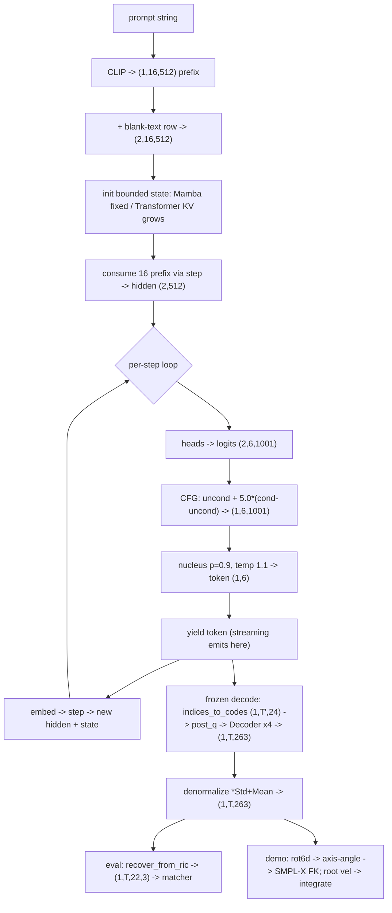

# Lesson 10 — The inference trace: a prompt becomes motion, value by value

> Now the other direction: text -> motion, every transformation, with shapes. This is the deployed
> path (and the demo). Same symbols as Lesson 9. Code: generator.py `stream`, tokenizer.py `decode`,
> feature.py `recover_*`. Note: NO teacher forcing here — the model feeds on its OWN outputs.

## The picture (shapes end to end)

## Stage 0 — the prompt
A string: `"a person walks forward and sits down"`.

## Stage 1 — encode the text (text_encoder.py)
CLIP -> **(1, 16, 512)** prefix (pooled + 15 token states). *Transformation: words -> 16 vectors in
the model's space.*

## Stage 2 — set up classifier-free guidance (generator.py stream)
Duplicate with a blank-text row: **(2, 16, 512)** = [conditional ; unconditional]. *We will run both
and extrapolate; this is how the caption is "amplified" (Lesson on CFG).*

## Stage 3 — initialise the bounded state
`backbone.init_state(batch=2)`:
- **Mamba**: zeroed SSM + conv state — **fixed size**, won't grow.
- **Transformer**: empty KV-cache — **will grow** one entry per step.
*This single difference is the thesis novelty, now live.*

## Stage 4 — consume the prefix
Feed the 16 prefix vectors through `backbone.step` one at a time -> running hidden **(2, 512)** and an
updated state. *The model has now "read" the caption.*

## Stage 5 — the generation loop (per token step)
1. **heads(hidden)** -> logits **(2, 6, 1001)**.
2. **CFG**: `uncond + scale * (cond - uncond)` (scale 5.0) -> **(1, 6, 1001)**. *Push along the
   text direction.*
3. (END model) mask the END column unless self-terminating.
4. **sample** per codebook: nucleus top-p 0.9, temperature 1.1 -> token **(1, 6)**. *Logits ->
   6 chosen integers. Non-greedy so it doesn't collapse.*
5. **yield** the token (this is where streaming emits — a chunk is ready before the rest exists).
6. **embed_tokens(token)** -> **(1, 512)** (duplicate for the 2 CFG rows) -> **backbone.step** ->
   new hidden + new state. *The model's own output becomes its next input.*
Repeat for the requested steps (or until END) -> tokens **(1, T', 6)**.

## Stage 6 — FROZEN tokenizer DECODE: tokens -> motion (tokenizer.py)
1. **indices_to_codes**: 6 ints -> the 24-D lattice point -> **(1, T', 24)**. *Discrete -> continuous,
   the inverse of FSQ rounding.*
2. **post_q** linear -> **(1, T', 512)**.
3. **Decoder1d**: resblocks + two upsample convs **x4 in time** -> **(1, T'*4, 263)**.
   *Transformation: 1 token step -> 4 frames; latent -> 263 features.*

## Stage 7 — denormalize
`feat * Std + Mean` -> **(1, T, 263)** in physical units. *Undo Stage-1 normalization.*

## Stage 8 — features -> a body
Two consumers (Lesson 3):
- **Eval**: `recover_from_ric` -> joints **(1, T, 22, 3)** -> the Guo matcher -> FID/R-prec.
- **Demo**: take rot6d slice -> axis-angle -> drive **SMPL-X** body (FK, no IK); root velocity ->
  integrate -> world trajectory; slerp 20->60 fps -> skinned mesh.

## The one-line journey (mirror of Lesson 9)
**text -> CLIP -> 16 prefix vectors -> (CFG) -> causal step over bounded state -> logits -> nucleus
sample -> 6 ints/step -> indices_to_codes -> decode (x4 up) -> denormalize -> 263 -> (rot6d->SMPL-X
FK | ric->joints).**

### Check
1. In training the model's input was the GT tokens (teacher forcing). What is its input here, and why
   is that the harder, realistic setting?
2. Which stage is the exact inverse of Stage-3 FSQ rounding from Lesson 9?
3. Where in this trace does "streaming" actually happen — i.e. the first frames can render before the
   last tokens are generated?
