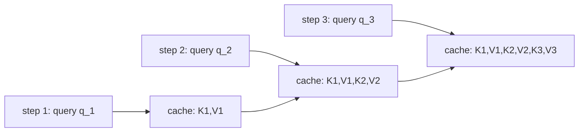

# Lesson 11 — The transformer twin: the controlled baseline (and why its memory grows)

> First of the two backbones that implement $f_\theta$ from Lesson 8. This is the **controlled twin**
> (T2M-GPT mold, arXiv:2301.06052): same objective, same heads, same loss, same sampler — only the
> function that turns history into $h_t$ differs. Its defining property is the one Contribution B sets
> out to beat: a streaming state that **grows with the sequence**. Grounded in
> `TransformerBlock` / `TransformerBackbone` (`src/text2motion/model/generator.py`).

## 11.0 The picture

*Streaming a transformer: the query at step t attends to ALL cached keys/values, so the state (the
KV-cache) grows with t. That growth is the cost Lesson 12 removes.*

## 11.1 The job, restated

From Lesson 8, the only model-specific object is
$$
h_t \;=\; f_\theta\big(\tilde c,\; e(z_1),\dots,e(z_{t-1})\big)\in\mathbb{R}^{d_{\text{model}}}.
$$
The transformer computes every $h_t$ by **attending over the whole past at once**. That is its
strength (direct access to any earlier token) and, for streaming, its cost (it must *keep* the whole
past). Both follow from the same equation below.

## 11.2 Self-attention

Project the (normalised) input to queries, keys, values, split into $H$ heads of width
$d_h = d_{\text{model}}/H$:
$$
Q = X W_Q,\quad K = X W_K,\quad V = X W_V \in \mathbb{R}^{L\times d_{\text{model}}},
\qquad d_h = d_{\text{model}}/H .
$$
Per head, the output is a softmax-weighted average of value vectors, with a **causal mask** $M$ that
forbids looking forward:
$$
\mathrm{Attn}(Q,K,V) = \mathrm{softmax}\!\Big(\frac{QK^\top}{\sqrt{d_h}} + M\Big)V,
\qquad
M_{ij} = \begin{cases} 0 & j \le i \\ -\infty & j > i \end{cases}.
$$
In code this is `F.scaled_dot_product_attention(q, k, v, is_causal=True)`. The mask is exactly what
makes attention agree with the autoregressive factorisation of Lesson 8: row $i$ of the output
depends only on tokens $\le i$.

## 11.3 The block

A pre-norm residual block (RMSNorm, as in §8), attention then a position-wise MLP:
$$
\begin{aligned}
x &\leftarrow x + \mathrm{Drop}\big(W_O\,\mathrm{Attn}(\mathrm{RMSNorm}(x))\big),\\
x &\leftarrow x + \mathrm{Drop}\big(\mathrm{MLP}(\mathrm{RMSNorm}(x))\big),\qquad
\mathrm{MLP}(u) = W_2\,\mathrm{GELU}(W_1 u),\ \ W_1\!:\,d\!\to\!4d.
\end{aligned}
$$
Dropout is train-only (identity at eval), so the streaming path (§11.5) is bitwise the parallel path.

## 11.4 Where order comes from — positional embeddings

Attention is **permutation-equivariant**: shuffle the input rows and the outputs shuffle the same way.
So the transformer has *no intrinsic notion of time* — order must be injected. The twin adds a
**learned** positional embedding $\mathrm{P}\in\mathbb{R}^{(L_{\max}+1)\times d_{\text{model}}}$:
$$
\text{input}_t = e(z_t) + \mathrm{P}[\,t\,].
$$
(`TransformerBackbone.forward` adds $\mathrm{P}[\arange(L)]$; `step` adds $\mathrm{P}[\text{cache length}]$.)
This is the seam Lesson 8 flagged and the cleanest contrast with Lesson 12: **Mamba needs no
positional embedding** because order is carried by its recurrence — a structural difference, not a
hyperparameter.

## 11.5 Streaming, and the growing state

To stream, the model emits one step at a time and must answer: what does $q_t$ attend to? Every past
key/value. So it caches them (`TransformerBlock.step`):
$$
K_{1:t} = [\,K_{1:t-1};\,k_t\,],\qquad V_{1:t} = [\,V_{1:t-1};\,v_t\,],\qquad
h_t \;\propto\; \mathrm{softmax}\!\Big(\frac{q_t K_{1:t}^\top}{\sqrt{d_h}}\Big)V_{1:t}.
$$
No causal mask is needed at step time (`is_causal=False`) — the cache *is* the past, all of it
visible. The consequence is the central fact of this lesson:

$$
\underbrace{\text{KV-cache size at step } t}_{\text{per layer, per head}} = O(t\,d_h)
\;\;\Longrightarrow\;\;
\underbrace{\text{state over } n_{\text{layers}} \text{ layers}}_{\text{grows linearly in } t}
= O(n_{\text{layers}}\,t\,d_{\text{model}}).
$$

Per-step compute is the score against all cached keys, $O(t\,d_{\text{model}})$, so generating a
horizon of $L$ steps costs
$$
\sum_{t=1}^{L} O(t\,d_{\text{model}}) = O\!\big(L^2 d_{\text{model}}\big),
$$
quadratic in the horizon. **This $O(L)$ memory / $O(L^2)$ compute is precisely the quantity
Contribution B replaces** with a fixed-size state and linear compute (Lesson 12-13). The forward
(parallel, masked) and step (cached) paths compute the same function, so we can train in parallel and
stream exactly — the comparison is apples-to-apples.

## 11.6 Making it a fair twin (not a strawman)

The claim of Contribution B is bounded memory **at matched quality**, which is only meaningful if the
transformer is *strong*. So the twins are matched on the controlled axes (Lesson 8 + the training
protocol): identical tokenizer, data, seed (2026), optimiser/schedule, and **parameter count**
(depth chosen so $\#\theta_{\text{transformer}} \approx \#\theta_{\text{Mamba}}$). Only the backbone
and its positional mechanism differ. On the 31.6M *pilot*, the transformer is a genuinely competitive
baseline (twin FID within $\sim\!1.19\times$ of its counterpart — traceable to the Phase-0 twin table
v0; 100M result pending). We are trying to *tie* its quality, not beat it — and win on the streaming
axis.

## 11.7 Big-picture fit

- It instantiates $f_\theta$ from Lesson 8 with full-context attention.
- Its growing KV-cache is the **baseline curve** of the signature streaming plot (Lesson 13).
- Lesson 12 keeps everything in §11.1-11.4 *except* §11.5: it replaces the growing cache with a
  fixed-size recurrent state, which is the entire bounded-memory contribution.

> **Bottom line:** the transformer twin attends over the whole past, so it is exact and easy to train
> in parallel, but to stream it must store the whole past — $O(L)$ state, $O(L^2)$ compute. That is a
> strong, fair baseline and exactly the cost the SSM twin is designed to remove.
