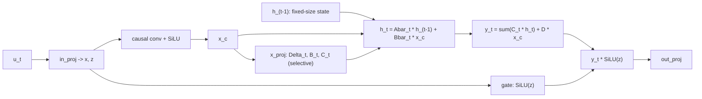

# Lesson 12 -- The S6/Mamba generator: a fixed-size state that streams

> The centerpiece of Contribution B. Same objective, heads, loss, and sampler as Lessons 8 and 11 --
> only $f_\theta$ changes. The transformer (Lesson 11) answered "what is $h_t$?" by attending over a
> past it must *store* ($O(L)$ state). Mamba answers it with a **recurrence over a fixed-size state**,
> so streaming memory is $O(1)$ in the horizon. To our literature survey, no published motion
> generator is a **token-autoregressive selective SSM** (Mamba motion work is diffusion- or
> masked-bidirectional) -- that unoccupied cell is the novelty. Grounded in `MambaMixer`
> (`src/text2motion/model/generator.py`), selective SSM of Gu & Dao (arXiv:2312.00752).

## 12.0 The picture

*The recurrence overwrites the state $h_t$ in place -- it has the same size at every step, never
growing. Contrast the transformer's growing cache in Lesson 11.*

## 12.1 The continuous state-space model

A linear SSM maps an input signal $x(t)$ to an output $y(t)$ through a hidden state $h(t)$:
$$
h'(t) = A\,h(t) + B\,x(t), \qquad y(t) = C\,h(t) + D\,x(t).
$$
We use a **diagonal** $A$ (one independent scalar recurrence per state channel), so all operations
below are elementwise -- that is what makes the fixed-size state cheap. In code $A$ is parameterised to
be negative (stable) and static:
$$
A = -\exp(a_{\log}) \in \mathbb{R}^{d_{\text{inner}}\times N},\qquad N=\texttt{d\_state},
$$
(`a = -torch.exp(self.a_log)`). Negativity gives $|\bar A|<1$ below, so the state decays rather than
explodes.

## 12.2 Discretisation (continuous -> recurrence)

Tokens are discrete steps, so we discretise the ODE with a per-step size $\Delta_t>0$. Zero-order hold
on a diagonal $A$ gives the state transition and (Mamba's simplified) input map
$$
\bar A_t = \exp(\Delta_t\, A), \qquad \bar B_t = \Delta_t\, B_t,
$$
yielding the **linear recurrence** the model actually runs:
$$
\boxed{\,h_t = \bar A_t \odot h_{t-1} + \bar B_t \odot x_t,\qquad y_t = \langle C_t, h_t\rangle + D\odot x_t\,}
$$
with $\odot$ elementwise over the diagonal. The code is this equation verbatim:
`da = exp(dt * a)` is $\bar A_t$, `dbx = dt * b * x` is $\bar B_t \odot x_t$,
`new_ssm = da * ssm_state + dbx` is the state update, and
`y = (new_ssm * c).sum(-1) + d_skip * x` is the readout.

## 12.3 Selectivity (the "S6") -- why $\Delta, B, C$ depend on the input

A classic SSM (S4) is **time-invariant**: $\Delta, B, C$ are fixed, so the whole map is a convolution
and cannot route information based on content. Mamba makes them **functions of the input** (`x_proj`,
`dt_proj`):
$$
[\,\Delta_t', B_t, C_t\,] = W_x\,x_t,\qquad \Delta_t = \mathrm{softplus}(W_\Delta\,\Delta_t').
$$
Because $\bar A_t = \exp(\Delta_t A)$ now depends on $x_t$, the state can **selectively remember or
forget** per step -- a large $\Delta_t$ writes the input strongly and decays old state; a small
$\Delta_t$ lets state persist. This input-dependence breaks linear-time-invariance and is the source
of the model's expressivity; $A$ stays static, only the *gating* of it is selective.

## 12.4 The full mixer block

Around the SSM, the block has a gated structure (`MambaMixer`): an input projection splits into a
content stream $x$ and a gate $z$; a **causal depthwise conv** mixes a short local window before the
SSM; SiLU nonlinearities; and a gated output projection:
$$
[x, z] = W_{\text{in}} u,\quad
x_c = \mathrm{SiLU}(\mathrm{Conv1d}_{\text{causal}}(x)),\quad
\text{(SSM on } x_c \to y),\quad
\text{out} = W_{\text{out}}\big(y \odot \mathrm{SiLU}(z)\big).
$$
Stacked with RMSNorm + residual into `MambaBlock` / `MambaBackbone`. Note: **no positional embedding**
-- order is intrinsic to the recurrence (the seam from Lessons 8/11). This is a structural saving, not
a tuned choice.

## 12.5 The bounded state -- the contribution, precisely

The entire streaming state is the SSM state plus the small conv buffer (`init_state`):
$$
h_t \in \mathbb{R}^{d_{\text{inner}}\times N},\qquad
\text{conv buffer} \in \mathbb{R}^{d_{\text{inner}}\times(d_{\text{conv}}-1)},
$$
both **independent of the horizon $t$**. Therefore, per step and over a horizon $L$:
$$
\text{memory} = O(d_{\text{inner}} N) = O(1)\ \text{in } L,\qquad
\text{compute} = \sum_{t=1}^{L} O(d_{\text{inner}} N) = O(L).
$$
Put beside Lesson 11's transformer -- $O(L)$ state, $O(L^2)$ compute -- this is the whole claim of the
thesis in two lines:
$$
\text{transformer (KV-cache): } O(L)\ \text{state},\ O(L^2)\ \text{compute} \quad\longrightarrow\quad
\text{Mamba (SSM state): } O(1)\ \text{state},\ O(L)\ \text{compute}.
$$

## 12.6 Train in parallel, stream by recurrence (the duality)

Run sequentially, the recurrence would be slow to train. But a first-order linear recurrence
$s_t = a_t\,s_{t-1} + x_t$ is an **associative scan**, computable in $\log_2 L$ parallel passes
(Heinsen 2023, arXiv:2311.06281) -- `_parallel_scan`, training cost $O(L\log L)$ vs the transformer's
$O(L^2)$. The fast path (`forward`) vectorises the projections + conv and runs the scan; the streaming
path (`step`) runs the identical recurrence one token at a time. They compute the **same function**
(asserted by `test_parity_mamba`), so *streamed logits equal batched logits by construction* -- the
bounded-memory claim is then just a property of the state shape, not a separate approximation. An
optional fused CUDA kernel (`selective_scan_fn`) accelerates the scan; the eager scan is the 4GB-GPU
fallback (loud import error if the kernel is requested but absent -- no silent downgrade).

## 12.7 What is evidenced, and what is pending

- **Structural (proven now):** the state shape is horizon-independent (sec. 12.5), and stream==batch
  parity holds (`test_parity_mamba`). The $O(1)$/$O(L)$ asymptotics are a *fact about the architecture*,
  not an experimental hope.
- **Empirical (pending):** that Mamba **matches** the transformer's FID at equal params/data/seed, and
  that the memory/latency-vs-horizon curves separate as predicted, are the 100M twin run + the
  streaming benchmark (Lessons 13-14). The pilot is encouraging but the citable numbers are not in yet
  -- say so to examiners.

## 12.8 Big-picture fit

This lesson supplies the second $f_\theta$. With Lessons 8 (objective), 11 (transformer twin), and 12
(this), the generator is fully specified and the comparison is controlled down to a single axis: the
backbone. Lesson 13 measures the consequence (latency/memory vs horizon -- the signature plot); Lesson
14 defines the quality metrics on which the twins must tie.

> **Bottom line:** Mamba computes $h_t$ by a selective linear recurrence over a fixed-size diagonal
> state. It needs no positional embedding, trains in $O(L\log L)$ via an associative scan, and streams
> in $O(1)$ memory / $O(L)$ compute -- the structural advantage that, *at matched quality*, is the
> thesis's second contribution.
