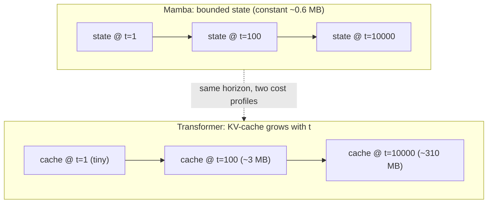

# Lesson 13 — Streaming and complexity: the bounded-memory payoff, in bytes

> The payoff chapter of Contribution B. Lesson 12 proved the SSM state is horizon-independent
> *asymptotically*; here we turn that into concrete byte counts and the measured latency/memory-vs-
> horizon curve — the thesis's signature figure. The claim is not "Mamba is more accurate"; it is
> **equal accuracy (Lesson 14) at bounded streaming cost** (this lesson). Grounded in `stream`,
> `MambaMixer.init_state`/`step`, and `TransformerBlock.step` (`generator.py`); numbers use the
> `GeneratorCfg` shapes ($d_{\text{model}}=512$, $n_{\text{layers}}=8$, $d_{\text{state}}=16$,
> $d_{\text{conv}}=4$, $\text{expand}=2 \Rightarrow d_{\text{inner}}=1024$).

## 13.0 The picture

*Same horizon, two state profiles: Mamba's box stays the same size for any t; the transformer's cache
grows linearly. This is the signature plot in cartoon form — Lesson 13.5 measures the real curve.*

## 13.1 The streaming contract (the novelty restated)

Real-time text-to-motion means emitting motion **incrementally** — one token step, decode, show,
repeat — without re-reading the whole past. Formally the generator must admit a recurrence
$$
(y_t, h_t) = g_\theta(h_{t-1}, x_t),\qquad \dim(h_t)\ \text{bounded in } t,
$$
so that producing step $t$ costs the same whether $t=10$ or $t=10^4$. `MotionGenerator.stream` is
exactly this loop: initialise a state, consume the text prefix once, then yield one $(B,R)$ token step
per iteration. The entire question is the size of $h_t$.

## 13.2 The two state shapes, in bytes

**Mamba (`init_state`)** — per layer, the SSM state plus a tiny causal-conv buffer:
$$
\underbrace{d_{\text{inner}}\times d_{\text{state}}}_{\text{SSM}} + \underbrace{d_{\text{inner}}\times(d_{\text{conv}}-1)}_{\text{conv}}
= 1024\cdot16 + 1024\cdot3 = 19\,456 \ \text{floats/layer},
$$
$$
\times\, n_{\text{layers}}=8 \;\Rightarrow\; 155\,648\ \text{floats} \approx \mathbf{0.6\ MB\ (fp32)},\ \textbf{constant in } t.
$$

**Transformer (`TransformerBlock.step`)** — the KV-cache stores every past key and value; at step $t$,
per layer:
$$
2\,(k,v)\times n_{\text{heads}}\times t\times d_{\text{head}} = 2\,t\,d_{\text{model}} = 1024\,t\ \text{floats/layer},
$$
$$
\times\, n_{\text{layers}}=8 \;\Rightarrow\; 8192\,t\ \text{floats} \approx \mathbf{0.03\,t\ MB},\ \textbf{linear in } t.
$$
So at horizon $t=1000$ the transformer already holds $\approx 31$ MB of cache and keeps growing; Mamba
holds $0.6$ MB at $t=1000$, at $t=10^4$, at $t=10^6$. The 100M preset scales the *constants*
($d_{\text{model}}, n_{\text{layers}}$) but not the *shape* of the curves — that is the whole point.

## 13.3 Complexity, side by side

| | streaming **state** (memory) | **compute** per step | **compute** over horizon $L$ |
|---|---|---|---|
| Transformer twin | $O(n_{\text{layers}}\,t\,d_{\text{model}})$ — **grows** | $O(t\,d_{\text{model}})$ | $\sum_t O(t d) = O(L^2 d)$ |
| **Mamba** | $O(n_{\text{layers}}\,d_{\text{inner}}\,d_{\text{state}})$ — **constant** | $O(d_{\text{inner}}\,d_{\text{state}})$ | $O(L)$ |

Training (teacher-forced, parallel) is $O(L^2 d)$ for attention vs $O(L\log L)$ for the associative
scan (Lesson 12.6) — so Mamba is asymptotically cheaper to *train* too, though our headline claim is
about *inference/streaming*.

## 13.4 Why "stream == batch" makes the figure trustworthy

Both backbones implement `forward` (parallel) and `step` (recurrent) that compute the **same**
function (`test_parity_mamba`; dropout is eval-identity). Therefore the model whose *quality* we
measure with `forward` (Lesson 14) is bit-for-bit the model whose *cost* we measure with `step` (this
lesson). There is no "fast approximate inference mode" caveat to defend — efficiency and accuracy are
read off one model.

## 13.5 The measured figure (run on 100M twins, to horizon 8192)

`eval/streaming_bench.py` steps both backbones' `step()` to long horizons on **random-weight 100M
twins** (latency/state are architecture properties — no checkpoint needed). Measured
(`outputs/streaming_bench*.json`, RTX 3050, batch 1; transformer 95.4M/12 layers, Mamba 96.4M/23):

| horizon | Transformer state | Mamba state | Transf. ms/step | Mamba ms/step |
|---|---|---|---|---|
| 64   | 5.9 MB  | **2.68 MB** | 11 | 24 |
| 1024 | 76.7 MB | **2.68 MB** | 12 | 37 |
| 2048 | 152 MB  | **2.68 MB** | 23 | 28 |
| 4096 | 303 MB  | **2.68 MB** | 25 | 28 |
| 8192 | 605 MB  | **2.68 MB** | **264** | **53** |

**Memory — decisive at every horizon:** Mamba's recurrent state is **2.68 MB flat**; the transformer's
KV-cache grows linearly to **605 MB at 8192** (~225x) and is unbounded. **Latency — crossover at
~4096:** below ~4k steps the shallower transformer is faster per step; the two meet near 4096
(~25 vs ~28 ms); then the transformer's quadratic attention dominates — at **8192 it is 264 ms/step vs
Mamba's 53 ms (~5x slower)**, with a 1 GB peak vs Mamba's flat 0.4 GB. So at long horizons **both**
memory and latency favor the SSM; at short horizons the win is purely memory. The crossover is **pinned
by data**, not asserted. (Mamba's per-step time is also expected to drop with the fused scan kernel.)

## 13.6 Why this matters for the use case

A bounded state means the viewer can stream **indefinitely** — a continuous performance, a never-
ending prompt sequence — at fixed per-step cost and memory. The transformer twin must either grow its
cache without bound (eventual OOM / rising latency) or drop history (a sliding window, which changes
the model). Bounded recurrent state is therefore not a micro-optimisation; it is what makes
open-ended real-time generation *possible* on fixed hardware (e.g. the 4GB laptop GPU).

## 13.7 Big-picture fit

This lesson supplies the **efficiency half** of Contribution B's two-part claim:
- Lesson 12 built the fixed-size-state model; **Lesson 13** quantifies its streaming cost (constant
  memory, linear compute) against the transformer's growing cache — the signature plot.
- Lesson 14 supplies the **quality half**: the twins must *tie* on FID/R-precision, or "cheaper" would
  be meaningless. Only "tie on quality **and** win on streaming cost" is the contribution.

> **Bottom line:** measured on the 100M twins, Mamba streams in a **fixed 2.68 MB** of state at every
> horizon; the transformer's KV-cache grows to **605 MB at horizon 8192** (O(L), ~225x). Latency
> crosses over near ~4096 steps — by 8192 the transformer is **264 ms/step vs Mamba's 53 ms (~5x)**.
> Because `step` and `forward` are the same function, this efficiency is a property of the very model we
> score for accuracy — so memory is decisive everywhere, and latency too past ~4k steps.
