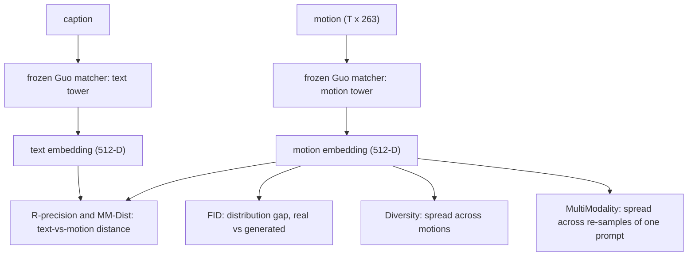

# Lesson 14 — Evaluation metrics: what the numbers mean

> Closes the generator arc. Lessons 8-13 built and analysed the model; this lesson defines, with the
> exact formulas we compute, the numbers that decide whether it works — so every value in a results
> table has a rigorous meaning. The headline claim (Contribution B) is **twin parity on these quality
> metrics at bounded streaming cost** (Lesson 13); "cheaper" only counts if quality ties. Grounded in
> `eval/metrics.py`, the Guo et al. (CVPR 2022) protocol reused unmodified for comparability.

## 14.0 The picture

*Every metric is a distance in one shared 512-D space produced by a frozen, pre-trained matcher we
never modify. That is what makes our numbers comparable to the published field.*

## 14.1 The shared embedding space (the one assumption)

All metrics operate on $(N, 512)$ L2-normalised features from the **frozen Guo matcher**, which maps
both captions and motions into a common space where matched pairs lie close. We never retrain it —
that is the contract that keeps FID comparable across papers. Reusing the field's evaluator (not
building our own) is a deliberate methodological choice, not a convenience.

## 14.2 FID — distributional realism

FID treats the real and generated motion embeddings as two Gaussians and measures the Fréchet
distance between them (`fid`, `frechet_distance`):
$$
\mathrm{FID} = \lVert \mu_r - \mu_g \rVert_2^2 \;+\; \mathrm{Tr}\!\Big(\Sigma_r + \Sigma_g - 2\big(\Sigma_r \Sigma_g\big)^{1/2}\Big),
$$
with $\mu,\Sigma$ the mean and covariance of each set of $(N,512)$ embeddings. It rewards matching the
*distribution* of real motion (both its centre and its spread), not any single sample. **Lower is
better.** Caveats to state: it assumes Gaussian embeddings (standard but approximate) and is biased by
sample size $N$ — which is exactly why the tokenizer generalization audit (Lesson 7) compares splits
at *equal* $N$.

## 14.3 R-precision — does the motion match the text

Retrieval accuracy (`r_precision`): for each caption, rank its true motion against $31$ distractors
($\text{pool\_size}=32$) by Euclidean distance in the shared space, and check whether the true match
falls in the top-$k$:
$$
\mathrm{R@}k = \frac{1}{M}\sum_{i=1}^{M} \mathbb{1}\!\big[\,\mathrm{rank}(\text{true motion}_i) \le k\,\big],\qquad k\in\{1,2,3\}.
$$
**Higher is better.** It is the direct measure of *text faithfulness* — the generated motion must be
retrievable from its caption against confusable alternatives. (Pool size and seeded distractor draw
are part of the protocol and must be reported.)

## 14.4 MM-Dist — text-to-motion closeness

The mean Euclidean distance between each paired text and motion embedding (`mm_dist`):
$$
\mathrm{MM\text{-}Dist} = \frac{1}{M}\sum_{i=1}^{M}\lVert t_i - m_i \rVert_2.
$$
**Lower is better.** A complementary, retrieval-free view of faithfulness: how close the generated
motion lands to its own caption.

## 14.5 Diversity — does the model avoid collapse

Average distance over $300$ random pairs of *generated* motion embeddings (`diversity`):
$$
\mathrm{Diversity} = \frac{1}{P}\sum_{(a,b)}\lVert m_a - m_b \rVert_2,\qquad P=300.
$$
It detects mode collapse (the T2M-GPT greedy failure of Lesson 8): a model emitting the same motion
scores near zero. The target is **close to the GT diversity**, not "as high as possible" — too high
means noise, too low means collapse.

## 14.6 MultiModality — variation within one prompt

One caption should admit many valid motions. MultiModality samples the generator $k$ times per prompt
and measures the average spread of those $k$ embeddings, then averages over prompts:
$$
\mathrm{MModality} = \frac{1}{M}\sum_{i=1}^{M}\ \frac{1}{\binom{k}{2}}\sum_{a<b}\lVert m_{i,a} - m_{i,b}\rVert_2.
$$
It requires a generator that produces multiple samples per prompt (CFG + nucleus sampling, Lesson 8),
so it is added in `evaluate.py` rather than the shared `metrics.py`. Like Diversity, the goal is
*calibration* to GT, not maximisation.

## 14.7 The protocol (how a number becomes citable)

- **Selection discipline:** model selection on **val**; **test** scored once (the same rule we just
  applied to the tokenizer in Lesson 7). 20-rep averaging with mean +/- std for the final table.
- **The harness oracle:** the GT row must reproduce published numbers — ours does (R@1 0.514 vs
  published 0.511, Diversity 9.67 vs 9.50, MM-Dist 2.977 vs 2.974). This is the proof the matcher and
  data wiring are correct *before* we trust any model row (the external-oracle check of Lesson 3).
- **Every reported number carries:** split, #clips, #reps, CFG scale, length mode, run-dir id.

## 14.8 Big-picture fit

These five define the axes the twins are compared on:
- **FID + R-precision + MM-Dist** are the *quality* axes both backbones must **tie** on — only then
  does Lesson 13's streaming win mean something. "Parity here, advantage there" is the entire claim.
- **Diversity + MultiModality** guard against the degenerate ways a model can fake good FID
  (collapse, or noise).
- The tokenizer's **recon-FID** (Lesson 7) is the same FID of §14.2 applied to encode-decode rather
  than generation — it caps what any generator on those tokens can reach. So Lessons 7 and 14 use one
  consistent yardstick across both contributions.

> **Bottom line:** all five metrics are distances in one frozen shared space — FID for distributional
> realism, R-precision/MM-Dist for text faithfulness, Diversity/MultiModality for healthy variation.
> Reusing the field's evaluator unmodified, and reproducing the published GT row, is what turns our
> numbers from "internal" into "citable."
