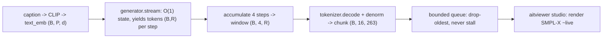

# Lesson 15 -- The live streaming demo: bounded decode to a viewer

> The visible payoff of Contribution B. Lesson 13 proved the *generator's* state is bounded; a live
> demo needs the **whole pipeline** -- generation, decode, and transport -- to be bounded too, or it
> stalls. This lesson is that pipeline, grounded in `stream/decode.py` (the decode loop + bounded
> queue are implemented; the aitviewer mesh render is the Phase-5 deliverable being finished).

## 15.0 The picture (with shapes)

## 15.1 From bounded state to a bounded pipeline

The generator streams tokens with $O(1)$ state (Lesson 13). But three more things must each be bounded
or the demo cannot run forever:
1. **decode memory** -- we must not buffer the whole token sequence before decoding;
2. **transport** -- a slow renderer must not force the generator to wait (or block its memory);
3. **per-chunk work** -- fixed, independent of how long we have been streaming.

`stream/decode.py` satisfies all three. The result is a pipeline whose memory and per-step cost are
flat in the horizon -- the property that makes *open-ended* real-time generation possible.

## 15.2 Windowed decode (decode as tokens arrive)

`StreamingMotionDecoder.stream_tokens` consumes per-step tokens $(B, R)$ and, every
$\texttt{chunk\_tokens}=4$ steps, decodes that window to motion frames:
$$
\text{window } (B, 4, R)\ \xrightarrow{\ \text{tokenizer.decode}\ }\ (B,\,4\cdot\text{downsample},\,263) = (B, 16, 263)\ \xrightarrow{\ \cdot\sigma+\mu\ }\ \text{denormalised chunk}.
$$
It never waits for the full sequence -- a chunk of 16 frames is emitted as soon as 4 token-steps exist,
then the window resets (no growing buffer). A trailing partial window is flushed at the end.

**Honest caveat (state it):** each window is decoded *independently*, so the non-causal conv decoder
has mild window-boundary artifacts versus one full-sequence decode. Overlap-add is a future
refinement; crucially, **the bounded-memory claim is about the generator, not this lightweight
decode**, so this does not affect the thesis result -- only demo polish.

## 15.3 The bounded queue: drop-to-latest

`run_producer` (a daemon thread) pushes each chunk onto a **bounded** queue via `_put_drop_oldest`:
if the queue is full, it discards the *oldest* chunk to make room and never blocks. The contract:
$$
\text{producer pace} \perp \text{consumer pace}\quad\Rightarrow\quad \text{a lagging viewer loses old frames, the generator never stalls.}
$$
This is the real-time guarantee in code form. A `STREAM_END` sentinel (also pushed drop-safe) tells the
consumer generation is done. The queue's fixed capacity caps transport memory regardless of horizon.

## 15.4 What is implemented vs pending

- **Implemented:** `generator.stream` (bounded-state token generation), `StreamingMotionDecoder`
  (windowed decode), `run_producer` (bounded queue, drop-to-latest, sentinel). The producer side of a
  live demo is complete and testable headless.
- **Pending (Phase 5):** the consumer -- `render/studio.py` wiring CLIP text entry to the producer and
  rendering the SMPL-X mesh from the decoded 263 (rot6d -> FK), plus a headless MP4 export. This is a
  deliverable, not a research risk.

## 15.5 Why this is the thesis's visible payoff

Bounded generator state (Lesson 13) is the *claim*; this loop is the *demonstration* of it: type a
prompt, watch motion appear chunk-by-chunk at fixed per-chunk cost, for as long as you like. The
transformer twin could drive the same loop, but its KV-cache grows with the horizon (Lesson 11), so an
open-ended session eventually slows or exhausts memory -- exactly the failure the Mamba backbone
avoids. The demo is therefore not decoration: it is the use-case that motivates the bounded-state
architecture, and (per Lesson 3.5) also the final qualitative validation instrument -- correct
trajectory, planted feet, correct bends, seen live.

> **Bottom line:** the live pipeline is bounded end-to-end -- $O(1)$ generator state, fixed-size
> windowed decode, and a drop-to-latest bounded queue -- so generation never stalls and memory stays
> flat over any horizon. That is Contribution B made visible; the remaining work is wiring the viewer,
> not proving the claim.
