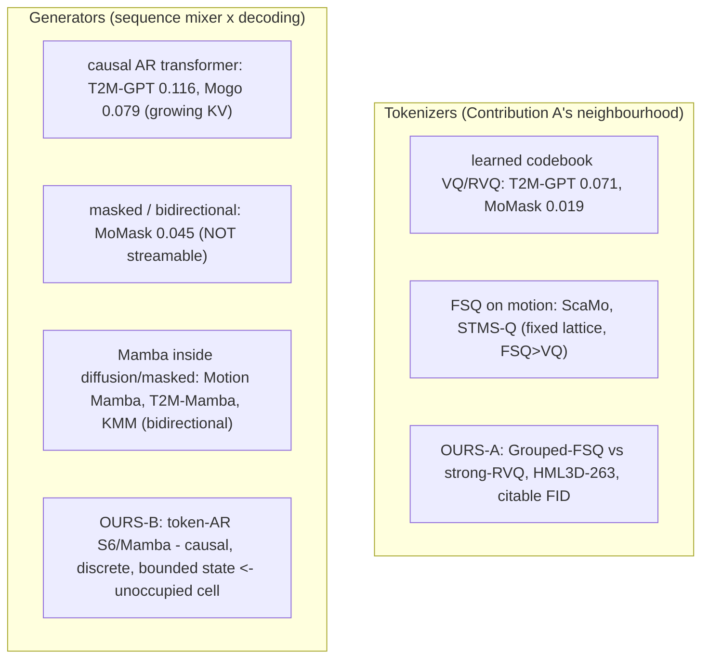

# Lesson 16 -- Related work and positioning: where our two contributions sit

> Now that the system is understood (Lessons 1-15), this chapter places it in the field -- what exists,
> what does not, and the precise empty cell each contribution fills. Every citation traces to
> `.claude/docs/references.md` (real arXiv ids + reported HumanML3D FID). The discipline an elite
> committee applies: claim only the unoccupied cell, and cite-and-distinguish everything adjacent.

## 16.0 The landscape

## 16.1 Contribution A -- Grouped-FSQ vs strong-RVQ on HumanML3D-263

- **The learned-codebook line:** VQ-VAE (van den Oord, 1711.00937) -> RVQ in audio (SoundStream
  2107.03312, EnCodec 2210.13438) -> motion: **T2M-GPT** (2301.06052, VQ recon-FID 0.071) and
  **MoMask** (2312.00063, RVQ recon-FID **0.019** / MPJPE 29.5 mm -- the target to beat).
- **The fixed-lattice line:** **FSQ** (Mentzer 2309.15505, ~100% usage, no machinery); motion-proofs
  **ScaMo** (2412.14559, FSQ>VQ) and **STMS-Q** (2508.08991, multi-scale FSQ beats MoMask).
- **Our cell:** a **Grouped-FSQ tokenizer benchmarked head-to-head against a strong EMA+reset RVQ on
  HumanML3D-263 at matched bits/step with a citable FID** (Lessons 5-7). The FSQ idea is not new; the
  *controlled HumanML3D head-to-head with the dominance result* (Lesson 7.0a) is.
- **Honest novelty flag:** **AnyMo** (2605.29488, 2026) uses a 4-stage Residual-FSQ tokenizer (close
  to our design) -- but on OmniHuMo, **no** HumanML3D recon-FID, **no** code. It does not scoop us; it
  *tightens* our framing to "matched, citable HumanML3D-263 comparison."

## 16.2 Contribution B -- the first token-autoregressive S6/Mamba motion generator

- **Causal AR transformers** (our twin's mold): **T2M-GPT** (2301.06052, FID 0.116, KV-cache),
  **Mogo** (2412.07797, causal RVQ, explicitly streaming, 0.079), **AttT2M** (2309.00796, 0.112).
- **The reference ceiling, not streamable:** **MoMask** (2312.00063, masked-bidirectional, 0.045) and
  kin (MMM 2312.03596, BAMM 2403.19435) -- strong FID but their bidirectional passes **fail the
  streaming gate**.
- **Mamba already in motion -- but never as we use it:** **Motion Mamba** (2403.07487), **T2M-Mamba**
  (2602.01352), **KMM** (2411.06481) all place Mamba *inside diffusion or masked, bidirectional*
  pipelines. **None is a token-autoregressive Mamba/S6 generator.** That is the unoccupied cell
  (selective-scan core: Mamba/S6 2312.00752, S4 2111.00396).
- **The closest rival, distinguished:** **LLaMo** (2602.12370, 2026) does real-time *streaming*
  motion -- but with a **continuous** autoregressive latent (like MotionStreamer), **not a discrete
  next-token SSM**. We cite it and distinguish on **discrete + SSM**.
- **Our claim is a 4-conjunct cell:** next-token AND discrete AND causal AND fixed-state SSM. Each
  conjunct is occupied somewhere; their conjunction is not.

## 16.3 What we deliberately are NOT

We are **not a scale competitor.** The large-motion line -- LMM (2404.01284, diffusion-transformer),
Being-M0/MotionLib (2410.03311, million-clip + LFQ), MotionMillion (2507.07095), MotionGPT
(2306.10900) -- pursues data/model scale. Our niche is the **opposite axis**: a *controlled mechanism
study* -- bounded-state SSM vs a **parameter-matched** transformer twin, at matched data/seed/budget,
on standard HumanML3D with a citable FID. Scale is orthogonal; we isolate the sequence-mixer.

## 16.4 What we reuse unmodified (so numbers stay comparable)

- **The 263 representation + the frozen Guo evaluator** (CVPR 2022) -- Lessons 3, 14. Never retrained.
- **CLIP ViT-B/32 text encoder**, pooled-projected 512-d as a prefix token -- the exact T2M-GPT/MoMask/
  Mogo recipe (with our minimal last-layer unfreeze, Lesson B). T5 is *rejected* -- it would break FID
  comparability.
- **Published baseline numbers** (MoMask 0.045, T2M-GPT 0.116, Mogo 0.079) cited as the reference
  ceiling; we do not retrain a baseline generator.

## 16.5 Big-picture fit

The map above is the thesis's one-paragraph defence: Contribution A occupies the *FSQ-vs-RVQ,
matched, citable HumanML3D* cell; Contribution B occupies the *token-AR discrete causal SSM* cell;
both reuse the field's evaluator so the numbers are admissible. Everything adjacent is cited and
distinguished on a specific axis (scale, continuity, bidirectionality, dataset), which is exactly the
positioning an examiner checks before accepting a novelty claim.

> **Bottom line:** the FSQ tokenizer and the causal-AR transformer are each known; our contributions
> are (A) their *controlled, citable HumanML3D head-to-head* and (B) the *token-autoregressive S6/Mamba
> generator* -- a 4-conjunct cell no published motion model occupies -- both measured on the field's own
> unmodified yardstick.
