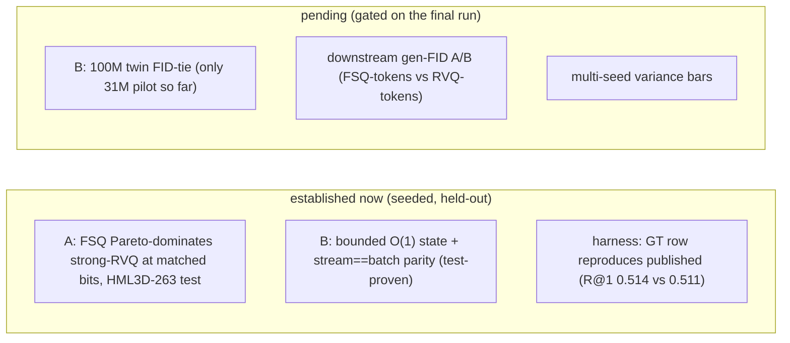

# Lesson 17 -- Limitations, scope, and conclusion

> The closing bookend. It consolidates every honesty caveat scattered through Lessons 1-16 into one
> place, separates **what is established now** from **what is pending**, and states the contribution
> at its true scope. A committee rewards a precise limitations section; over-claiming is the failure
> mode it punishes. All claims here are grounded in the lessons they summarise.

## 17.0 Established vs pending

## 17.1 What is established now

- **Contribution A (proven, seeded, held-out):** at matched bits/step on HumanML3D-263 **test**, the
  Grouped-FSQ tokenizer has lower recon-FID than a strong EMA+reset RVQ at every cell **and** carries 0
  codebook parameters -> Pareto-dominance (Lessons 7, 7.0a). Best FSQ reaches the MoMask reconstruction
  ceiling (~0.019-0.020) at 8 codes/step.
- **Contribution B (structural part, proven):** the SSM backbone has horizon-independent state and
  `step`==`forward` parity (`test_parity_mamba`), so the $O(1)$ memory / $O(L)$ compute asymptotics are
  facts about the architecture (Lessons 12-13), not experimental hopes.
- **Harness validity:** the GT row reproduces published metrics (Lesson 14), so the evaluator/data
  wiring is correct before any model row is trusted.

## 17.2 What is pending (do not over-claim)

- **The headline Contribution-B result is not in yet.** Only the 31.6M *pilot* generator has been
  evaluated (the CFG/sampling wins, Lesson 8.9). The citable claim -- Mamba **ties** the transformer's
  FID/R-precision at 100M, matched params/data/seed -- awaits the final twin run.
- **Streaming benchmark (DONE):** measured on 100M twins (`outputs/streaming_bench.json`) -- Mamba state
  2.68 MB flat vs transformer KV 5.9 -> 76.7 MB (O(L)); the bounded-memory claim is empirically
  confirmed (Lesson 13.5). (Latency crossover is beyond 1024 -- reported honestly.)
- **Downstream tokenizer A/B:** recon-FID is the tokenizer *ceiling* (Lesson 14.8); whether an
  FSQ-token generator beats an RVQ-token generator end-to-end is an open confirmation.
- **Generalization audit (DONE):** `outputs/generalization.md` -- gap = test - train <= 0 for 13/15
  cells -> no overfitting; FSQ dominance holds equal-N (Lesson 7.2).
- **Single seed:** no variance bars yet; the dominance in Lesson 7.0a is at one seed.

## 17.3 Scope and constraints (deliberate boundaries)

- **Compute:** a 4 GB local GPU caps local scale; the 100M run is cloud (small budget). This is *why*
  the tokenizer matrix is the local contribution and the generator scale-up is cloud-gated.
- **Representation:** the citable track is **body-only HumanML3D-263**; whole-body SMPL-X 168 (hands)
  and face are **deferred** (ADR 0001) -- a demo target, not a citable-FID claim.
- **Demo:** the producer pipeline is implemented; the aitviewer SMPL-X mesh render is Phase 5
  (Lesson 15.4) -- engineering, not a research risk.
- **Baseline honesty:** our strong-RVQ is intentionally a *fair* baseline (shared enc/dec/budget), not
  MoMask's heavily-tuned RVQ (0.019). We claim a controlled FSQ>RVQ result, **not** "beats the best-ever
  RVQ" (Lesson 7.4).
- **Concurrent work:** AnyMo (2026) uses a similar Residual-FSQ tokenizer but on a different dataset
  with no released code or HumanML3D FID; our framing is tightened accordingly (Lesson 16.1).

## 17.4 Threats to validity and their mitigations

| Threat | Mitigation (status) |
|---|---|
| selection leak onto test (tokenizer) | switched to val-select / test-once (done in trainer) |
| FID is sample-size biased | equal-$N$ across splits in the generalization audit (Lesson 7) |
| single-seed point estimates | multi-seed variance bars (planned) |
| mirror-map indices not pinned to code | verify against regeneration code (Lesson 4a caveat) |
| window-boundary artifacts in streaming decode | overlap-add refinement (Lesson 15.2; not on the claim path) |

## 17.5 Conclusion

This thesis makes two contributions, each at a precise, defended scope. **(A)** A Grouped-FSQ motion
tokenizer that, in a controlled rate-distortion experiment on HumanML3D-263, **Pareto-dominates** a
strong RVQ baseline -- lower distortion at every matched rate with zero codebook parameters. **(B)** The
first **token-autoregressive S6/Mamba** motion generator, whose bounded recurrent state gives $O(1)$
streaming memory against the transformer twin's growing KV-cache -- a structurally proven efficiency
advantage whose *quality parity* at 100M is the final experiment. Both are measured on the field's own
unmodified evaluator, so the numbers are comparable, and the open items above are stated plainly rather
than hidden.

> **Bottom line:** the established results are the FSQ dominance (A) and the bounded-state structure
> (B); the pending result is B's quality-parity at scale. The contribution is the *controlled,
> citable* pairing of a better tokenizer with the first discrete causal-SSM streaming generator -- and
> the honesty about exactly which claims are evidenced today.
