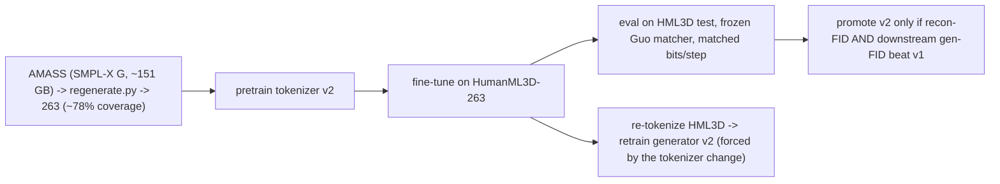

# Lesson 18 -- Scaling the tokenizer with data (not just codes)

> A future-work / methods chapter. Lesson 6.6a scaled tokenizer capacity along **codes** (bits/step);
> this scales it along **data** -- pretraining on a larger corpus (full AMASS, later derivatives). It
> states the two non-negotiable rules, the feasibility, and the protocol, so the option is on the
> record *before* the generator is frozen. Grounded in `regenerate.py`, the E7b plan lever, and the
> scaling references in `.claude/docs/references.md` (Being-M0 / MotionLib).

## 18.0 The versioned pipeline

## 18.1 Two orthogonal axes of tokenizer capacity

- **Codes** (Lesson 6.6a): bits/step $=R\log_2 V$ -- how much *information* a step can carry.
- **Data** (this lesson): how much *motion variety* the encoder/decoder have seen. A tokenizer with
  ample bits but trained on little data underfits the manifold; more data sharpens the same bits.

They are independent: you can raise either. This chapter is purely the data axis.

## 18.2 Rule 1 -- the tokenizer is the generator's vocabulary (no hot-swap)

The generator (Lesson 8) predicts token indices defined by a *specific* tokenizer. Retraining the
tokenizer yields **different codes**, so the generator's targets change. Therefore swapping in a
data-scaled tokenizer **forces a re-tokenize + generator retrain** -- a *versioned redo*, not a
drop-in:
$$
\text{tokenizer v2} \;\Rightarrow\; \text{re-tokenize data} \;\Rightarrow\; \text{generator v2}.
$$
**Sequencing consequence:** if v2 is to appear in the *final* numbers, train it **before** committing
the final generator (Lesson 17 lists "freeze the tokenizer" as a precondition). Doing it afterward
costs a full generator retrain.

## 18.3 Rule 2 -- the citable evaluation stays on HumanML3D-263

FID is comparable only on HumanML3D-263 with the frozen Guo evaluator (Lessons 7, 14, 16); AMASS has
no comparable FID. So the recipe is **pretrain on the big corpus, fine-tune and evaluate on the
citable one**:
$$
\text{pretrain (AMASS)} \to \text{fine-tune (HML3D-263)} \to \text{eval (HML3D test, frozen matcher)},
$$
which is exactly the Being-M0 / MotionLib justification: scale data for the encoder, then return to
the comparable distribution for the numbers.

## 18.4 Feasibility (already wired)

- The donor AMASS is the **SMPL-X G** release; `regenerate.py` forwards it through the SMPL-X body
  model to 263 at **~78% coverage** (the rename resolver handles gaps) -- the data path exists.
- The tokenizer is small (Lesson 6: two ~512-wide conv stacks + zero-parameter FSQ), so the 4 GB GPU
  is fine; more data means more **steps per epoch**, not more VRAM.

## 18.5 Will it help? -- the rate-distortion check (be honest)

More data lowers the distortion curve $D(r)$ **only if the tokenizer was data-limited.** Two tempering
facts:
- HumanML3D is *built from* AMASS, so on the **HML3D test** AMASS mostly adds *in-distribution* data
  -> diminishing returns, and we are already near the MoMask reconstruction ceiling (~0.019) at 8
  codes. Headroom on that exact metric is small.
- Where it genuinely wins: **out-of-distribution robustness** (motions the generator invents that
  HML3D under-covers), the **deferred whole-body / SMPL-X track**, and as a clean **ablation row**.

So the honest hypothesis is "small recon-FID gain on HML3D, larger robustness/coverage gain" -- and
either outcome is a reportable finding.

## 18.6 The protocol (a controlled ablation, not a silent swap)

Same ruler as Lesson 7 (matched bits/step, HML3D test, seed 2026):
1. Train **tokenizer-v2** = AMASS-pretrain -> HML3D fine-tune at the chosen best config.
2. Compare to v1 on **recon-FID** *and* **downstream gen-FID** (the open A/B of Lesson 17).
3. **Promote** v2 only if it beats v1 on *both*; else keep it as an ablation row + whole-body seed.

This treats "a bigger dataset" as just another **treatment under the same protocol** -- so "scale
helped / did not help the tokenizer" is publishable either way.

## 18.7 Big-picture fit

Data-scaling is **orthogonal** to the thesis's two mechanism claims (Contribution A = FSQ-vs-RVQ at
matched bits; Contribution B = SSM-vs-transformer at matched budget). Adding it does not muddy those
controlled studies -- it is a *separate axis*, reported as future work / an ablation, with its
dependency (Rule 1) and comparability constraint (Rule 2) made explicit so no claim leaks across axes.

> **Bottom line:** yes, the tokenizer can be scaled on AMASS or derivatives -- pretrain there,
> fine-tune and score on HumanML3D-263. But the tokenizer is the generator's vocabulary, so a scaled
> tokenizer is a versioned redo (re-tokenize + retrain), and it must be promoted only on a matched
> recon-**and**-gen-FID win. Treated that way, "more data" is a clean, separable contribution rather
> than a confound.
