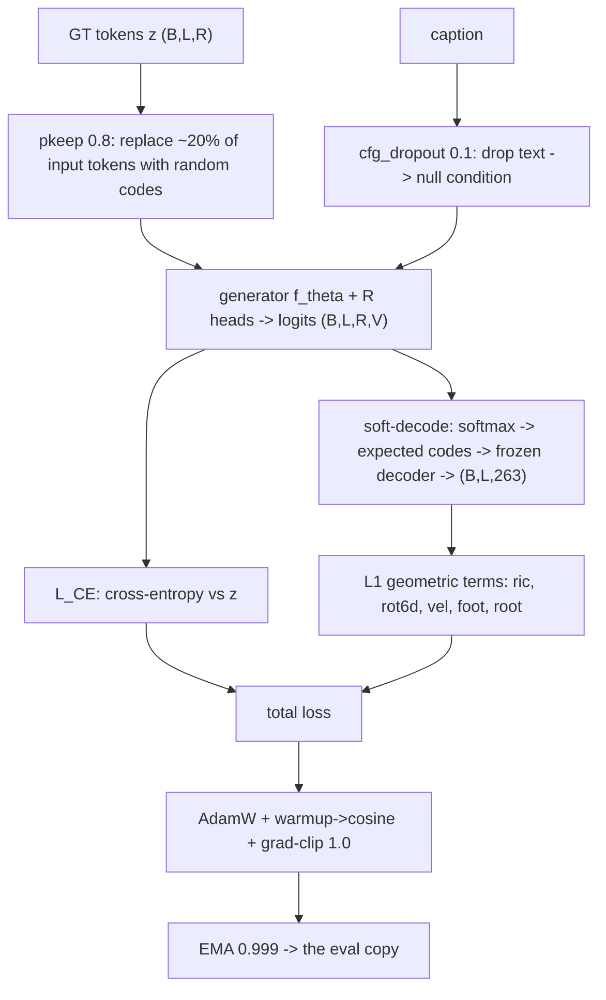

# Applied Lesson B -- Escaping the plateau: the training recipe and reproducibility

> Companion to Lesson A (A = the loss + optimizer math; **B = the full recipe around them + how every
> number is made reproducible**). This project is a rebuild whose prior attempt **plateaued** (top-1
> ~12% vs MoMask ~25%, FID never computed). This chapter is the consolidated set of design constraints
> that answer that failure, each grounded in `TrainCfg` / `trainer.py` / `losses.py`.

## B.0 The training step (with shapes)

## B.1 Why this chapter exists

A model can train smoothly and still plateau far from the field. The prior attempt did exactly that.
The cure is not one trick but a **set of constraints applied together**; dropping any one re-opens the
plateau. We list each with its mechanism and our value.

## B.2 The plateau-avoidance levers (the consolidated checklist)

| Lever | Mechanism | Our setting |
|---|---|---|
| Full data + mirror | enough signal to learn the distribution | all clips, train-only mirror (Lesson 4a) |
| Losses beyond CE | CE is motion-blind; geometry adds fidelity | term-split L1 via soft-decode (Lesson A) |
| EMA on eval | average out late-training jitter | $\beta=0.999$ |
| Long enough schedule | sequence models need the full anneal | warmup 1000 -> cosine over the whole run |
| Don't fully freeze text | a frozen encoder caps text grounding | unfreeze last layer + LN + projection |
| Non-greedy sampling | greedy collapses (T2M-GPT) | nucleus + temperature + CFG (Lesson 8) |
| Scale the generator | 5M is too small | 50-150M target (Lesson 13 shapes) |
| FID early and often | catch plateaus on day 1 | val FID every few epochs, sanity-overfit first |

## B.3 CFG training dropout (so guidance exists at inference)

Classifier-free guidance (Lesson 8.7) needs *both* a conditional and an unconditional model. We train
them in one network by dropping the text condition with probability $p_{\text{drop}}=0.1$:
$$
c' = \begin{cases} \varnothing & \text{with prob } p_{\text{drop}} \\ c & \text{otherwise} \end{cases},
\qquad p_{\text{drop}} = \texttt{cfg\_dropout} = 0.1.
$$
Without this, $p_\theta(z\mid\varnothing)$ is never learned and the inference-time extrapolation
$\ell_\varnothing + s(\ell_c-\ell_\varnothing)$ has no valid $\ell_\varnothing$ -- the single biggest
free quality lever (the pilot's $-42\%$ FID at $s{=}5$, Lesson 8.9) depends on it.

## B.4 pkeep -- fighting exposure bias

Teacher forcing feeds **ground-truth** past tokens during training, but at inference the model feeds
**its own** (sometimes wrong) tokens -- a train/test mismatch (*exposure bias*). We corrupt the input
stream: keep each input token with probability $\texttt{pkeep}=0.8$, else replace it with a random
code. The model thus learns to recover from imperfect history, narrowing the train/inference gap.
(Note: targets are unchanged -- only the *inputs* are corrupted.)

## B.5 Not freezing the text encoder

A fully frozen CLIP encoder was a plateau cause: the motion task cannot adapt the text features at
all. We unfreeze the **last transformer layer + final layer-norm + the projection**
(`unfreeze_last_n=1`, `unfreeze_projection=True`) and give that group a small separate learning rate
($10^{-5}$ vs $2\times10^{-4}$ for the generator) so the pretrained features adapt gently without being
washed out.

## B.6 Reproducibility -- what turns a number into evidence

Every quantitative claim must trace to a run, or it is not admissible:
- **Seed 2026 everywhere** (`seed=2026`) -- twins, tokenizer sweeps, eval; recorded in each manifest.
- **Strict determinism** (`deterministic=True`) -- cuBLAS workspace + cuDNN deterministic +
  `use_deterministic_algorithms`, so a re-run reproduces bit-for-bit.
- **Run manifests** (`run_log.py`) -- config + git commit + seed + library versions at `start_run`,
  then `metrics.jsonl` per epoch/eval. Any number in an ADR / the dissertation points to a run dir.
- **Selection discipline** -- model selection on **val**, **test** scored once (Lessons 7 and 14).

## B.7 The schedule, precisely

$$
\eta(t) = \begin{cases}
\eta_{\max}\,\dfrac{t}{T_{\text{warm}}} & t \le T_{\text{warm}}=1000 \\[2mm]
\eta_{\min} + (\eta_{\max}-\eta_{\min})\,\tfrac12\big(1+\cos\frac{\pi (t-T_{\text{warm}})}{T-T_{\text{warm}}}\big) & t > T_{\text{warm}}
\end{cases}
$$
with $\eta_{\min}=0.01\,\eta_{\max}$ (`lr_min_ratio`). Warmup tames the noisy early gradients that can
wreck a sequence model; the cosine is sized to the **full** run, so the run length must be chosen to
land its peak-quality window (the ~60-epoch budget).

## B.8 What to hold onto

1. The plateau cure is a **set** of constraints, not one trick -- B.2 is the checklist.
2. **CFG dropout 0.1** is what makes the inference-time guidance win *possible*.
3. **pkeep 0.8** narrows the teacher-forcing / inference gap (exposure bias).
4. **Partial text-encoder unfreezing** lifts the cap a frozen encoder imposes.
5. **Seed + determinism + manifests + val-selection** are what make the results *citable*, not merely
   internal -- the standard an elite committee applies.
